ได้เวลากลับมาเขียนบล็อค คนอื่นเขียนเรื่องเที่ยว เรื่องกิน เรื่องไหว้พระในฮ่องกงเยอะแล้ว เลยลองเขียนในมุมคนที่ชอบการเดินทาง ระบบขนส่งและเล่นเกมจัดการเมืองอย่าง Cities: Skylines ดีกว่า

เมื่อพูดถึงเมืองที่น่าอยู่ที่สุด ทุกคนอาจจะให้ฮ่องกงอยู่ลำดับท้าย ๆ ของเมืองใหญ่ แต่ถ้าพูดถึงการจัดการ ความมีประสิทธิภาพ ฮ่องกงอาจจะเป็นเมืองอันดับต้น ๆ ของโลกเลยก็ว่าได้

กลางเดือนพฤษภาที่ผ่านมาได้ไปเที่ยวฮ่องกงครั้งแรก ตั้งแต่ก้าวแรกที่ออกจากสนามบินก็พบว่านี่มันเป็นเมืองที่จัดการได้ดีมาก เป็นสวรรค์ของคนที่ชอบเล่นเกมสร้างเมืองอย่าง Cities: Skylines กันเลยทีเดียว!

ใครที่เล่น Cities: Skylines ก็น่าจะทราบกันดีว่าวิธีการแก้ปัญหารถติดที่ดีที่สุดคือระบบขนส่งมวลชน ส่วนวิธีที่แย่ที่สุดก็คือกรุงเทพฯ ที่ขยันสร้างถนนเพิ่ม สร้างเลนเพิ่ม แล้ววนเป็นลูปนรกเพราะ [induced demand](https://en.wikipedia.org/wiki/Induced_demand) (คนมองว่าขับรถสะดวกกว่า ก็เลยขับเพิ่มกัน ทำให้รถกลับมาติด) ฮ่องกงคือเมืองที่ให้ความสำคัญกับระบบขนส่งมวลชนมากตั้งแต่ก้าวแรก ๆ ที่จะออกจากสนามบิน

## ประทับใจตั้งแต่ยังไม่ก้าวออกจากสนามบิน

ความประทับใจแรกของฮ่องกงคือ ตั้งแต่ออกจากตม.มาก็เจอเคาน์เตอร์ขายตั๋วรถไฟ Airport Express เข้าเมืองทันที ด้านหลังของเคาน์เตอร์ก็มีรถไฟขบวนนึงเปิดประตูต้อนรับอยู่ แปลว่าผู้โดยสารสามารถนั่งรถไฟเข้าเมืองได้โดยที่ยังไม่ต้องลงบันไดเลื่อนเลยแม้แต่ชั้นเดียว! (ส่วนสุวรรณภูมิออกมาจะเจอรถยนต์และลานจอดรถก่อน รถไฟเข้าเมืองต้องลงไปด้านล่าง) ซึ่งการเอารถไฟมาเทียบท่ารอผู้โดยสารเป็นความใส่ใจต่อรายละเอียดที่น่าประทับใจมาก

เราสามารถเดินขึ้นรถไฟโดยไม่ต้องผ่านประตูเก็บเงินแม้แต่ประตูเดียว (หลอกล่อให้มีอุปสรรคน้อยที่สุด) หลังจากขึ้นไปนั่งรอบนรถไฟได้ไม่กี่นาที รถก็พาผู้โดยสารเต็มขบวนออกเดินทางไปอย่างรวดเร็ว เพียง 20 กว่านาทีกับ 1 สถานีระหว่างทางรถไฟก็จอดส่งที่สถานีเกาลูน (Kowloon) ซึ่งเป็นสถานีรองสุดท้ายของสายนี้ เมื่อลงจากรถไฟเราก็จะพบกับประตูเก็บเงินที่รอทักทายอยู่ ค่าเสียหายอยู่ที่ HK$100 (~450 บาท)

## สถานีเกาลูน

จะหาสถานีรถไฟของไทยเพื่อเปรียบเทียบกับสถานีเกาลูนก็ค่อนข้างยาก กรุงเทพอภิวัฒน์คงเป็นการเปรียบเทียบที่พอเห็นภาพที่สุด สถานีนี้เป็นสถานีเชื่อมต่อหลายสายรวมถึงมีสถานีรถเมล์ด้วย (ใช้คำว่าสถานีแทนป้าย เพราะมันยิ่งใหญ่กว่ามาก นึกภาพหมอชิตแต่สำหรับรถเมล์) แปลว่าเราสามารถต่อรถไฟหรือรถเมล์ได้ภายในอาคารเดียวกัน ไม่ต้องร้อนแดดหรือเปียกฝนเลยทีเดียว ข้อเสียของสถานีนี้คือป้ายค่อนข้างงงสำหรับคนที่มาครั้งแรก เราหาทางออกไปขึ้นรถเมล์ค่อนข้างนาน (= หลง) ถ้ามีป้ายว่า **Bus** น่าจะดีกว่านี้ (สถานีใช้คำว่า *Transport Interchange (จุดเชื่อมต่อระบบขนส่ง)* ซึ่งมันชวนสับสน)

พอไปถึงสถานีรถเมล์ มันจะมีจุดจอดเป็นช่อง ๆ ให้กับรถเมล์ คล้าย ๆ กับอาคาร Bus station ใน Cities: Skylines แต่ละช่องเดาว่าเป็นสำหรับแต่ละบริษัทเดินรถ เราขึ้นรถสาย 8 ที่ไม่ใช่แฮปปี้แลนด์–สะพานพุทธเพื่อไปโรงแรม

ตัวรถเมล์จะเป็นรถเมล์สองชั้นแบบเดียวกับรถเมล์ของอังกฤษ เราก็ลากกระเป๋าเดินทางใบใหญ่ขึ้นรถเมล์แล้วไปวางตรงช่องที่นั่งคนพิการ พอรถออกตัวกระเป๋าก็ไหลไปตามกฎของนิวตัน ป้าที่นั่งข้างหลังคงสมเพชก็เลยเดินมาเอาเข็มขัดนิรภัยที่ใช้รัดรถเข็นคนพิการมาผูกกระเป๋าไว้ให้ ความพีคก็คือระหว่างที่รถขับไปตามทางที่เหมือนเยาวราชที่ยาว 10 กม. เราก็กำลังดูวิว ถ่ายรูปข้างทางไปเรื่อย รถก็จอดที่ป้ายนึง แล้วก็มีคนพิการบนวีลแชร์ขึ้นมาบนรถ ทีนี้เรากับแฟนก็เลิ่กลั่กว่าจะทำยังไง คนขับก็เดินมาชี้ ๆ ว่าให้เอากระเป๋าออกไป ก็เลยเข็นมาวางไว้ข้างตัว ด้วยความที่ทางเดินบนรถค่อนข้างแคบ ก็เป็นเป้าสายตาให้ผู้โดยสารนับสิบที่ขึ้นจากป้ายนั้นเหมือนกัน บางคนก็มองกระเป๋าด้วยสายตาที่เซ็ง ๆ แล้วก็หันไปมองจุดที่คนพิการนั่งอยู่ สายตาก็เปลี่ยนเป็นเข้าใจและสมเพชทันที

โชคดีที่ต้องทนแรงกดดันนี้ไม่นาน อีกประมาณ 2–3 ป้ายก็ถึง YMCA แถวเยาหม่าเต๋ย (Yau Ma Tei) แล้วพวกเราก็ลงป้ายนี้ลากกระเป๋าเข้าสู่โรงแรม The Cityview อันเป็นจุดหมายของพวกเรา

## โรงแรม The Cityview

โรงแรมนี้ได้รับคำแนะนำจากชิน ([ตะลุยกิน ตะลอนเที่ยว Hong Kong 4 วัน 3 คืน](https://blog.cloudian.in.th/2024/02/08/4-nights-food-trip-hongkong)) และแน่นอนว่าจองผ่าน Agoda ให้สมกับเป็นพนักงานที่ดี ตัวห้อง Deluxe Double Room มีขนาด 16 ตร.ม. ตอนแรกก็ทำใจไว้แล้วว่าน่าจะแคบ แต่พอเข้าไปอยู่ก็รู้สึกว่ากว้างพอ ๆ กับคอนโดสตูดิโอขนาด 24 ตร.ม.ในกรุงเทพฯ เลย ไม่รู้สึกอึดอัดอย่างที่คิดไว้

วิวของห้องได้เป็นวิวที่หันออกถนน Waterloo เห็นเนินเขาค่อนข้างสวยงามเลยทีเดียว

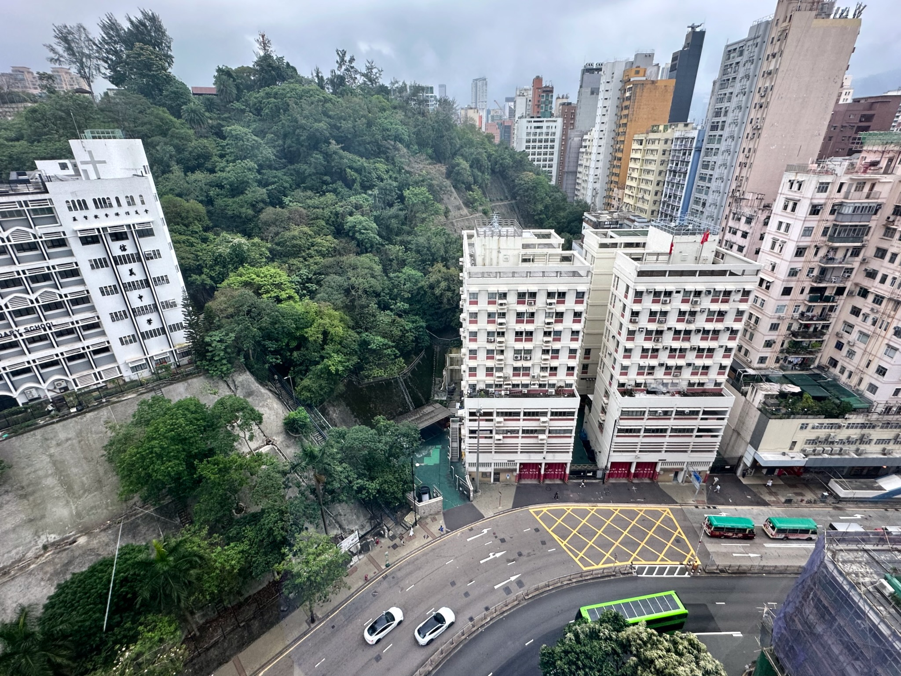

แต่เราไม่เน้นมานอน เราเน้นมาเที่ยว! หลังจากพักผ่อนสักพัก พวกเราก็ลงถนนไปผจญภัยกันต่อ!

## เดิน กิน และเดิน

ภารกิจวันแรกคือไปหาอะไรกิน มื้อแรกเป็นอาหารทะเล เราไปกินกันที่ Cooking Haha ตอนแรกเดินไปถึงร้านแล้วเดินเลยร้าน! เพราะตัวร้านอยู่บนชั้นสองของตึก ต้องขึ้นบันไดเล็ก ๆ ของอพาร์ทเมนต์ขึ้นไป พอไปถึงก็เจอภาษาจีนเข้าหน้าเป็นอันดับแรก เราก็เลยงัดภาษาจีนที่ร่ำเรียนมาสมัยเด็กมาสู้กลับว่า 「我是泰國人。 我不懂中文。」 (ฉันเป็นคนไทย ฉันไม่รู้ภาษาจีน) เท่านั้นแหละ พนักงานก็เดินไปหยิบเมนูแผ่นนึงมาให้ และเมนูแผ่นนั้นมีภาษาไทย!

ตัวร้านเป็นบุฟเฟต์อาหารทะเล มีหอยหลากหลายให้เลือก ตอนไปถึงโต๊ะ พนักงานก็ยื่นถังน้ำแข็งสแตนเลสมาให้บอกว่าไว้ใส่น้ำแข็ง ก็เลยเดินไปตักน้ำแข็งกัน ลุงที่กำลังแกะหอยอยู่เห็นว่ากำลังตักน้ำแข็งอย่างเมามันก็บอกว่า “พอแล้ว! พอแล้ว!” ก็งงสิครับ พออะไร จะเอาไปใส่น้ำกินโว้ย ลุงเห็นยืนงงก็รู้ละว่าอาตี๋นี่ไม่ได้เรื่อง เป็นดิสแอปพอยท์เมนต์ของชาวฮ่องกง เลยชี้ไปที่ก๊อกน้ำ ทีนี้ยิ่งงงไปใหญ่ แต่ก็เดินไปเติมน้ำก๊อกลงในถังน้ำแข็ง ลุงก็บอก “โอเค โอเค” ก็เลยปิดน้ำอย่างว่าง่าย แล้วเดินอย่างงง ๆ ไปที่โต๊ะ

พอไปถึงโต๊ะก็พบว่าข้าง ๆ ที่นั่งมีแทงค์น้ำกระจกใสคล้าย ๆ แทงค์ปลา ในนั้นมีกุ้งว่ายน้ำอยู่ หลังจากดูสักพักก็เข้าใจว่า คนที่มากินต้องจับกุ้งเอง แล้วเอากุ้งมาน็อคในถังน้ำแข็ง 😭 โต๊ะอื่นที่มากินคือเชี่ยวชาญมาก เอาที่คีบพุ่งลงไปแล้วหนีบกุ้งหมับเข้าให้อย่างรวดเร็ว แล้วก็เอามาน็อคน้ำแข็ง เอาฝาปิดเพราะกุ้งเต้น สักพักก็เอาขึ้นเตา ส่วนโต๊ะเราก็กินไปไม่กี่ตัว ใจไม่แข็งพอกินเยอะขนาดนั้น แต่อีกใจก็เสียดายเงิน 😭 เลยไปเน้นกินหอย ที่นั่นมีหอยเป่าฮื้อสด หอยนางรม และหอยอื่น ๆ ด้วย เอามาย่างกินอร่อยเลยทีเดียว แล้วก็น่าจะเป็นร้านที่คนไทยไปกินเยอะเพราะมีน้ำจิ้มซีฟู้ดให้ (แต่น้ำจิ้มไม่ค่อยอร่อยเท่าไหร่)

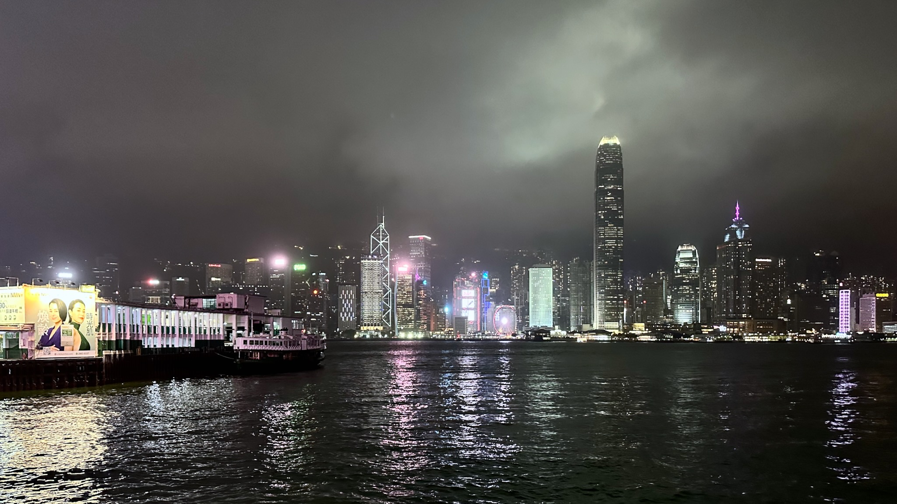

หลังจากกินเสร็จก็ไปเดินต่อ วันนั้นฝนตกปรอย ๆ อากาศเย็นสบาย ถ้ามีเสื้อกันหนาวที่มีฮู้ดแล้วยกขึ้นสวมก็คือได้ฟีลอังกฤษที่เคยไปเลย มันดีต่อใจสุด ๆ เดินกับแฟนไปเรื่อย ๆ จนถึงริมน้ำ เดินถ่ายรูปนิด ๆ หน่อย ๆ แล้วก็เดินกลับมาที่โรงแรม วันแรกเดินไปทั้งหมด 13 กม.กว่า ๆ

## Hong Kong Disneyland

วันที่สองแพลนของพวกเราคือฮ่องกงดิสนีย์แลนด์ วันนั้นออกค่อนข้างสายเพราะตื่นสาย 555 ข้าวเช้าเป็นร้านติ่มซำชื่อ Hay Wong Dim Sum แถวหม่องก็อก (Mong Kok) อร่อยเลยทีเดียว ฮะเก๋านี่กุ้งเน้น ๆ แล้วก็ฟองเต้าหู้ทอดอร่อยมาก ถ้าที่ไทยพอมีภัตตาคารกว้านสิ่วกี่แถวตลาดน้อยที่พอรู้สึกว่าสู้ได้บ้าง (กว้านสิ่วกี่นี้เมนูกุ้งอร่อย แต่หมูเฉย ๆ) พอกินเสร็จก็เดินไปขึ้นรถไฟฟ้าที่หม่องก็อกไปเปลี่ยนที่สถานีไร่ขิง (Lai King) แล้วไปลงที่ Sunny Bay เพื่อต่อรถไฟไปที่ดิสนีย์แลนด์

ตอนแรกเข้าใจว่ารถไฟไปดิสนีย์แลนด์จะเป็นรถไฟโมโนเรล ปรากฏว่าเป็นรถไฟ commuter rail (คล้ายสายสีแดง) เลย ตอนกลางวันทั้งเส้นมีรถวิ่งแค่ขบวนเดียวไป–กลับ แต่รอไม่นาน ประมาณ 10 นาทีก็ได้ขึ้นแล้ว ตัวรถทำหน้าต่างเป็นรูปมิกกี้เมาส์ ที่จับก็เป็นหูหนูสัญลักษณ์ของดิสนีย์เลย ตัวรางเป็นทางเดี่ยว แต่มีจุดเป็นทางคู่สั้น ๆ แถว ๆ กลางทาง ตัวสถานีดิสนีย์แลนด์สวยมาก มีสถาปัตยกรรมย้อนยุคไปแนววิคตอเรีย (วิกิบอกว่าเพื่อให้รู้สึกว่าได้เดินทางย้อนเวลาจากตัวเมืองมาสู่ดิสนีย์แลนด์ ดินแดนมหัศจรรย์)

ตอนไปถึงก็ไปจังหวะขบวนพาเหรดพอดี ได้ดูนิดหน่อยตอนท้าย แต่อากาศค่อนข้างร้อน แดดแรง เลยไปเริ่มจากจุดล่องเรือ คนขับเรือก็พูดแบบรัวมาก ฟังไม่ทัน จับใจความภาษาอังกฤษแทบไม่ได้เลย 555 เสร็จแล้วก็ไปเล่น RC Racer ได้แถวหลังสุด เสียวมาก แล้วก็มีไปเล่น Big Grizzly Mountain Runaway Mine Cars, Frozen Ever After, Hyperspace Mountain ฯลฯ ส่วนตัวรู้สึกว่า Hyperspace Mountain ที่เป็นธีมสตาร์ วอร์สเสียวที่สุด เพราะมันมืดแล้วรู้สึกว่าเร็วมาก

สิ่งนึงที่ดิสนีย์ทำได้ดีมากคือการจัดการคนและการรอ แถวขยับเรื่อย ๆ ไม่ได้ยืนรอนาน แล้วมีลำดับที่ดี ระหว่างที่คนจากรถคันนึงลง ก็ให้คนขึ้นอีกคัน ส่วนคันหน้าก็เช็คความปลอดภัย โฟลว์ดีมาก

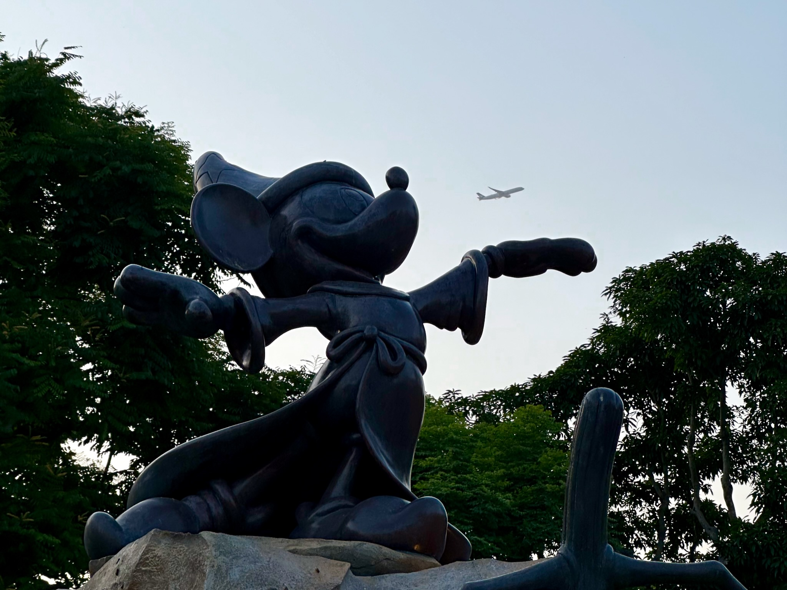

ระหว่างวันก็กินอาหารในดิสนีย์แลนด์ ซื้อตั๋วแบบ 3 meals ไป จะได้มื้อเที่ยงกับเย็น แล้วก็ปีอปคอร์นหรือไอติมอีกหนึ่ง อาหารไม่ค่อยอร่อย ป๊อปคอร์นก็เฉย ๆ บางเม็ดนี่เค็มเหมือนโรยเกลือทั้งมหาสมุทรมาไว้บนเม็ดเดียว แล้วก็เดินเล่นรอโชว์ปิดสวน Momentus ระหว่างรอโชว์ปิดสวนก็มีฉายอะไรเรื่อย ๆ แทบจะทุก 5 นาทีให้ไม่รู้สึกเบื่อ แล้วให้คนเดาว่าเรื่องที่ฉายอยู่เป็นเรื่องอะไร

โชว์ปิดสวนสวยมาก มันอาจจะไม่อลังการเท่าที่อื่น แต่นี่เป็นดิสนีย์แลนด์แรกของเรา ดิสนีย์ฉายภาพลงบนปราสาทแล้วก็มีแสง สี เสียง น้ำพุ และพลุประกอบตลอด ทำออกมาได้ดีมาก เราไม่ค่อยได้ถ่ายมาเยอะเพราะลองดูบนยูทุปแล้วมีคนที่ถ่ายจริงจังอัปโหลดแล้ว ก็เลยถ่ายนิด ๆ หน่อย ๆ แล้วเน้นมีความสุขกับสิ่งตรงหน้า

พอโชว์จบ มวลมหาประชาชนนับพันก็หลั่งไหลกลับ เรากับแฟนก็เดินดูของก่อนกลับรอให้คนซาประมาณ 20–30 นาที พอไปถึงสถานีรถไฟก็เตรียมใจไว้ว่าคนน่าจะเยอะมาก ปรากฏว่าโล่งมาก! มหัศจรรย์การจัดการของดิสนีย์ รอรถไฟแป๊บนึงรถก็มาละในใจก็คิดสงสัยว่าเค้าจัดการระบายคนได้ยังไงให้ไวขนาดนี้ เนื่องจากเป็นทางเดี่ยว กว่าจะไปถึง Sunny Bay แล้วกลับมาน่าจะนาน นั่งไปสักพักก็ถึงบ้างอ้อ เค้าใช้รถวิ่งสองขบวนแล้วมาสวนกันตรงแถวกึ่งกลางพอดี (passing loop) เลยสามารถทำเวลาได้ไวมาก

วันนั้นไม่ได้ทำอะไรมาก ตื่น ไปดิสนีย์แลนด์ กลับจากดิสนีย์แลนด์ แล้วก็นอน

## ไหว้พระวันประสูติ

วันที่สามในฮ่องกง (15 พ.ค.) เป็นวันประสูติของพระพุทธเจ้าสำหรับมหายานพอดี (มหายานใช้วันขึ้น 8 ค่ำเดือน 4 จีน) แล้วเป็นวันหยุดราชการ เลยถือเป็นวันไหว้พระซะเลย

วันนั้นกินข้าวเช้าที่ร้านถุงถาด (Tung Tat) ใกล้ ๆ โรงแรม เข้าไปก็นั่งเก้ ๆ กัง ๆ เอามือถือส่องป้ายแล้วก็สั่งมั่ว ๆ ได้ก๋วยเตี๋ยวปลามา รสชาติก็พอกินได้ คิดว่าปัญหาคือสั่งไม่เป็น ถ้าสั่งเป็นน่าจะได้ของอร่อย

กินเสร็จก็หาเรื่องเดินย่อยด้วยการเดินชิว ๆ ไปขึ้นรถไฟที่สถานีหม่องก็อกตะวันออก (Mong Kok East) รถไฟที่นั่งเป็นสาย East Rail Line สายนี้พิเศษตรงที่วิ่งยาวไปถึงเมืองเสิ่นเจิ้นในจีนได้เลย แล้วสายนี้มีตู้นึงเป็นที่นั่งเฟิร์สคลาสด้วย เหมาะกับคนที่นั่งยาว ๆ และมีเงิน ไม่ต้องมาหายใจร่วมกับคนจน ๆ อย่างเรา สถานีนี้เป็นสถานียกระดับ แล้วก็มีสถานีรถเมล์กับห้างในตัวตามสไตล์ MTR

รถไฟวิ่งไม่นานก็ถึงสถานีไตไหว่ (Tai Wai) สถานีนี้น่าจะนับว่าไกลตัวเมืองได้อยู่ แต่ก็ยังมีสถานีรถเมล์และห้างอยู่ในตัว (บนตัวห้างก็เป็นที่พักด้วย อารมณ์สามย่านมิตรทาวน์) เดินตามแผนที่เรื่อย ๆ ก็จะมาถึงวัดที่คนไทยเรียกว่าวัดกังหัน (Sha Tin Che Kung Temple) ระหว่างทางเดินเข้าไปก็มีโต๊ะหมอดูอยู่ระหว่างทาง ก็อยากลองดูขำ ๆ แต่น่าจะคุยกันไม่รู้เรื่อง

มาถึงวัดสิ่งที่เจอก่อนเลยคือคนไทย ที่พีคไปกว่านั้นก็คือ ป้ายหลายจุดมีภาษาไทย! ก็คือรู้เลยว่าคนชาติไหนมาบ่อยสุด ตัววัดค่อนข้างเงียบ ภายในศาลหลักก็มีคนไทยไหว้อยู่หลายกลุ่ม มีบางกลุ่มมีไกด์ด้วยก็เลยได้ความรู้ติดมานิด ๆ หน่อย ๆ ว่าเค้าไหว้อะไรกัน ไหว้พระไปได้สักพักก็ได้ยินคนกำลังทำพิธี ตอนแรกก็ไม่ได้สนใจอะไร สักพักได้ยินว่า “เฮง ๆ รวย ๆ ขอให้โชคดี!” ก็คือต้องกลั้นขำว่านี่ฉันอยู่ฮ่องกงใช่มั้ย

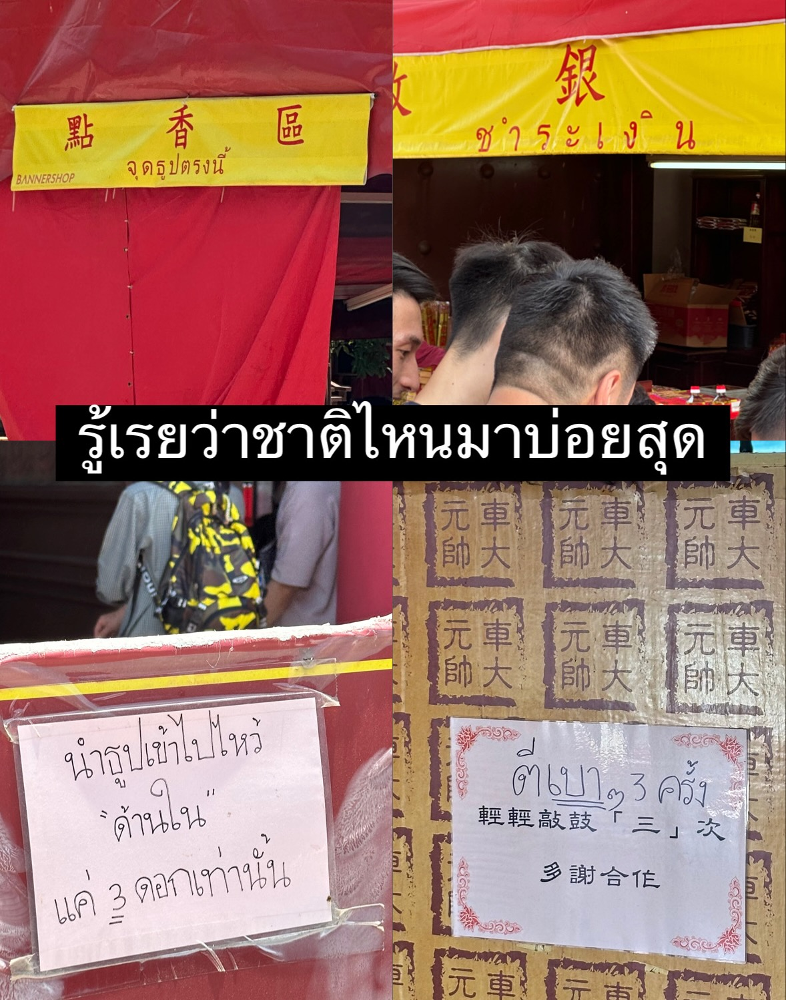

ไหว้เสร็จก็เดินกลับไปที่สถานีแล้วก็นั่งรถไฟไปต่อ ปลายทางคือสถานีหว่องไตซิน (Wong Tai Sin) วัดก็ชื่อเดียวกัน วัดนี้อยู่บนเนินเขาหน่อย ต้องเดินหรือใช้บันไดเลื่อนขึ้นไปก็ได้ วัดนี้คนเยอะกว่าวัดแรกมาก วัดนี้ไม่มีภาษาไทย แต่ยังมีคนไทยเหมือนเดิม คนส่วนใหญ่นิยมมาเสี่ยงเซียมซีกัน แล้วเค้าเสี่ยงเซียมซีกันนานมากกกก บางคนคือเราไหว้เสร็จแล้วยังเขย่าอยู่เลย ลุ้นแทน

ความน่าสนใจของวัดนี้คือตะเกียงจุดธูปเขาทำเป็นรูปหล่อของคนนั่งคุกเข่าถือตะเกียงให้จุดอยู่ ทำให้ดูสวย เข้ากับสถานที่มาก แล้วในตัววัดก็มีศาลขงจื๊อ ไม่รู้ว่านักเรียน นักศึกษาเค้ามาขอพรกันที่นี่หรือเปล่า

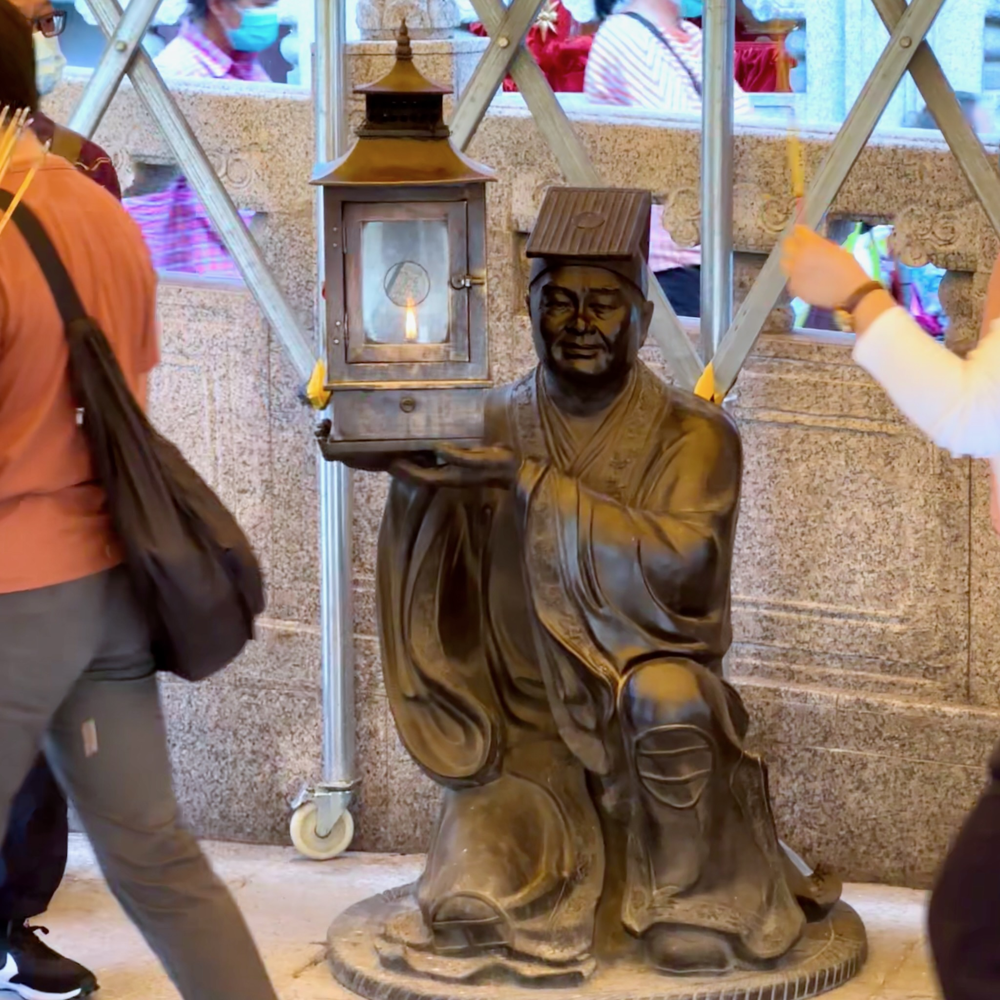

เดินไปสักพักก็เจอสวนสมุนไพรของวัด เป็นสวนค่อนข้างใหญ่เลยทีเดียว ร่มรื่นมาก มีป้ายบอกชื่อพรรณไม้ (แต่ก็ไม่รู้จักอยู่ดี 555) อยากให้วัดในไทยทำแบบนี้จะได้มีพื้นที่สีเขียวเพิ่ม เพราะวัดก็อยู่ในแหล่งชุมชนอยู่แล้ว พอแทนสวนสาธารณะไปได้บ้าง

ออกมาก็มีศาลอื่น ๆ แล้วก็มีเทพเจ้าด้ายแดงที่คนมาขอเรื่องความรักกัน แต่ในเมื่อเรามีแฟนแล้วเราจะขอไปทำไมล่ะ

หลังจากไหว้พระเสร็จก็เดินไปขึ้นรถไฟฟ้าต่อ ระหว่างทางเจอป้า 2–3 คนยืนทะเลาะกัน ด้วยสกิลไทยมุงก็เดาได้ว่า น่าจะเป็นคนขายของไหว้ทั้งคู่ แล้วแย่งลูกค้ากัน แต่ก็ไม่ได้*ใส่ใจ*มากนัก เพราะหิว 555 เลยนั่งรถไฟฟ้า 1 สถานีไป Diamond Hill

พอถึงสถานีแล้วก็หาอะไรกิน ฮ่องกงของค่อนข้างแพงเลย ข้าวมื้อละ HK$40+ ได้ พยายามเดินหาของราคาถูกสมฐานะ แต่หาไม่เจอ เลยจบที่ร้านที่มีเซ็ทกลางวัน เราก็สั่งเป็นก๋วยเตี๋ยวเนื้อตุ๋น แล้วก็ได้น้ำเต้าหู้มากินด้วยกัน รสชาติก็พอกินได้ ไม่ได้หวือหวาอะไร

ระหว่างวันก็มีกินชานมไข่มุก เบื่อ Gong Cha แล้ว เลยลอง Ten Ren’s Tea ตามคำแนะนำจากชินบ้าง ชาหอมมาก ได้ลองชานมผูเอ่อใส่ไข่มุก มันหอม ๆ นัว ๆ อร่อยแบบแปลก ๆ ดี อยากให้มีมาขายในไทย

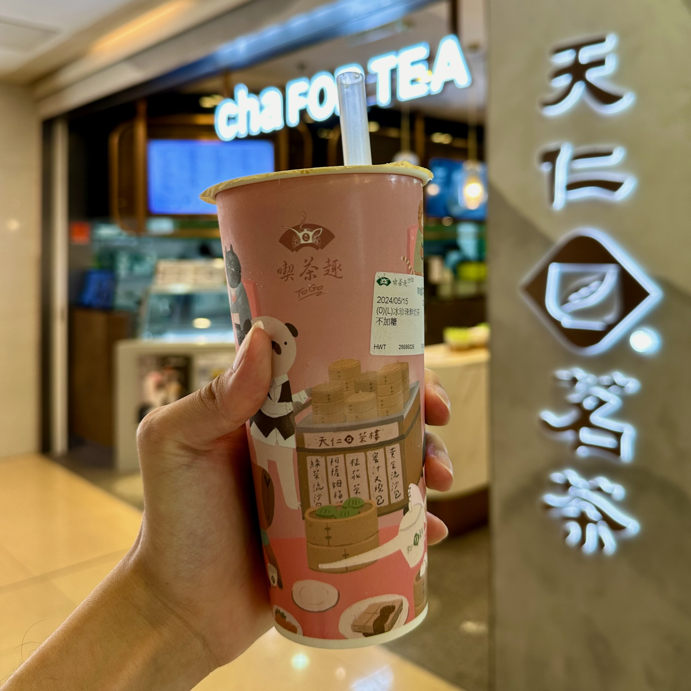

กินเสร็จก็มาเดินเล่นต่อที่สวนใกล้ ๆ ชื่อสวนหนานเหลียน (Nan Lian) ตัวสวนสร้างเชื่อมกับสำนักชีชิลิน (Chi Lin Nunnery) ตัวทางเขื่อมก็ทำเป็นสวนข้ามถนนไปเลย เดินเล่นในสวนและในวัดไปเรื่อย ๆ ก็เจอป้ายเขียนว่า *Buddha Bathing Ceremony* ก็เดินตาม ๆ ไป ในใจก็คิดว่ามันคงคล้าย ๆ สรงน้ำพระที่ไทย พอเดินไปเรื่อย ๆ ถึงจุดที่เขาทำพิธีกันก็เห็นอ่างคล้าย ๆ อ่างน้ำพุตามบ้าน ตรงกลางมีรูปปั้นเจ้าชายสิทธัตถะตอนเด็กยืนชี้นิ้วอยู่ รอบอ่างเป็นมังกรหลายตัวหันปากมาทางรูปปั้น วิธีสรงน้ำของที่นั่นก็คือ กดปุ่มแล้วมังกรจะพ่นน้ำใส่พระพุทธรูป บางคนก็กดรอบเดียว บางคนก็กด 3 รอบ ถือว่าเป็นอะไรที่แปลกดี (เสียดายที่ไม่มีรูป เพราะเขาไม่ให้ถ่ายรูปด้านใน และหาภาพที่ไม่ติดลิขสิทธิ์มาใส่ไม่ได้)

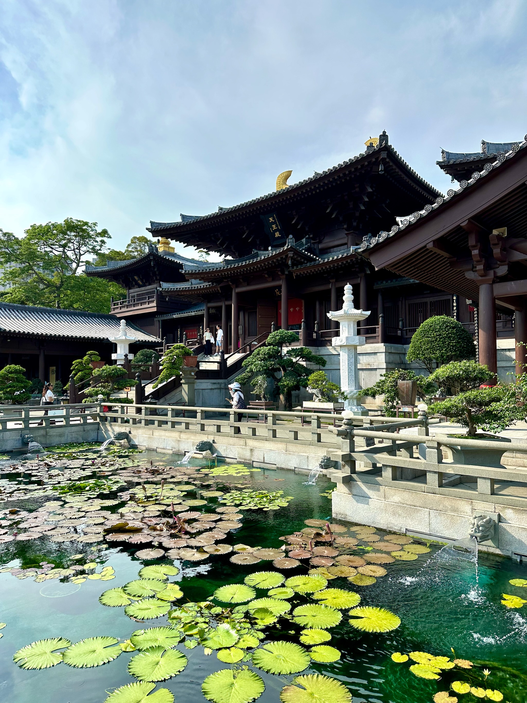

หลังจากเดินเล่นเสร็จก็จะไป Avenue of Stars ริมอ่าววิกตอเรียอีกรอบ แต่ก็แวะเดินเล่นแถวจิมซาจุ่ย (Tsim Sha Tsui) ก่อน ระหว่างทางเจอรถขายไอติม Mister Softee ก็แวะกินสักโคนตามประสาเด็กเห็นแก่กิน รสชาติอร่อย ราคาไม่แพง ใครเจอก็ขอให้ซื้อกินกันอย่าได้พลาด

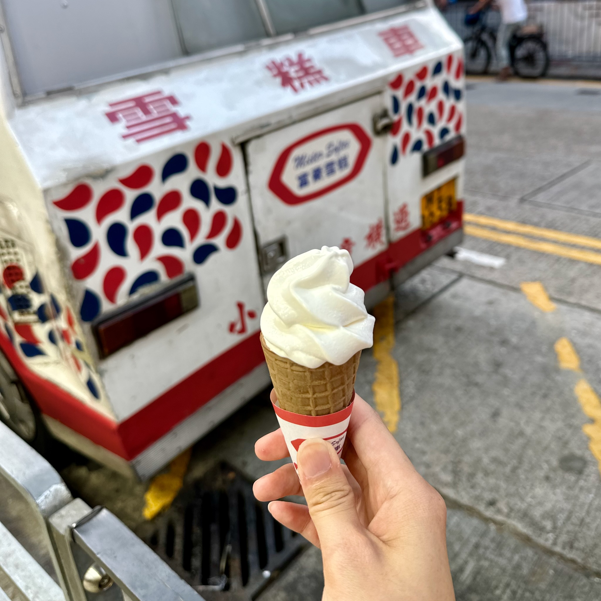

เดินมาเรื่อย ๆ ก็มาถึง Avenue of Stars รอบนี้เดินเล่น ถ่ายรูปตอนเย็น ๆ บรรยากาศดีมาก แต่ก็มีกลิ่นบุหรี่ประปราย วิวจากฝั่งเกาลูนมองไปเกาะฮ่องกงสวยมาก เห็นตึกระฟ้าเรียงรายเป็นเอกลักษณ์ของฮ่องกง รอบนี้ที่มาได้เห็นเรือเยอะขึ้น (แหงล่ะ รอบที่แล้วมาซะดึก) ได้เห็นเรือสำเภาลำนึง (ภาษาอังกฤษเรียก junk boat) ถือว่าได้มาถึงฮ่องกงเรียบร้อย

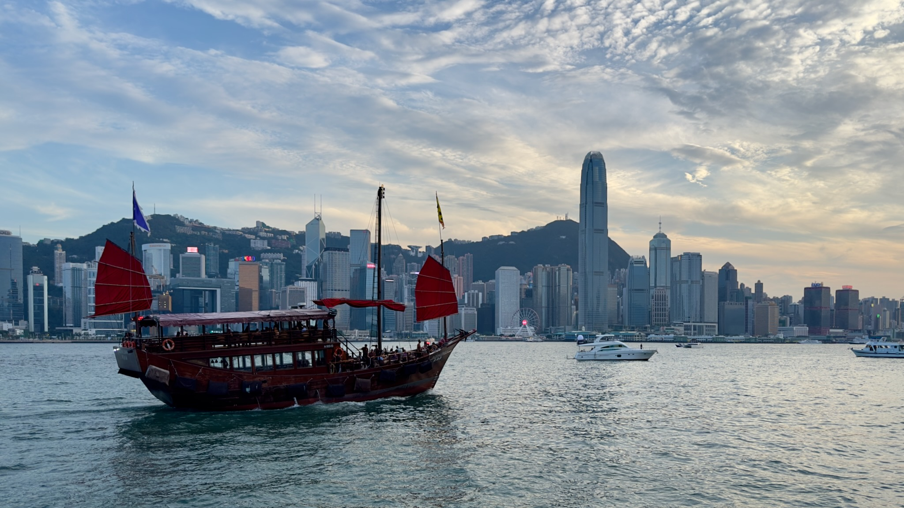

พูดถึงเรือแล้วอยากชวนให้ไปดูวิดีโอเรื่อง *[The Oldest Junk Boat Left In Hong Kong](https://youtube.com/watch?v=t-vMC5a9I0Y)* ของ Great Big Story ที่พูดถึงความพยายามในการรักษาเรือลำนี้ไว้ เป็นเรื่องที่น่าสนใจมาก ๆ

ถ่ายรูป เดินเล่นเสร็จก็ไปหาของกินต่อ ร้านวันนี้คือ Mak Man Kee ใครจะไปต้องระวังสับสนกับ Mak's Noodle ที่อยู่ใกล้ ๆ กัน ร้านนี้น่าจะดังในหมู่คนไทยเพราะมีเมนูภาษาไทยอีกแล้ว ตัวบะหมี่เส้นจะกรุบ ๆ อร่อยดี ที่เด็ดที่สุดคือเกี๊ยวกุ้ง กุ้งเน้น ๆ เต็มตัว น่าจะ 2 ตัวได้ กรุบกรอบมาก ยกให้ร้านนี้เป็นร้านบะหมี่เกี๊ยวกุ้งที่อร่อยที่สุดที่เคยกินมา

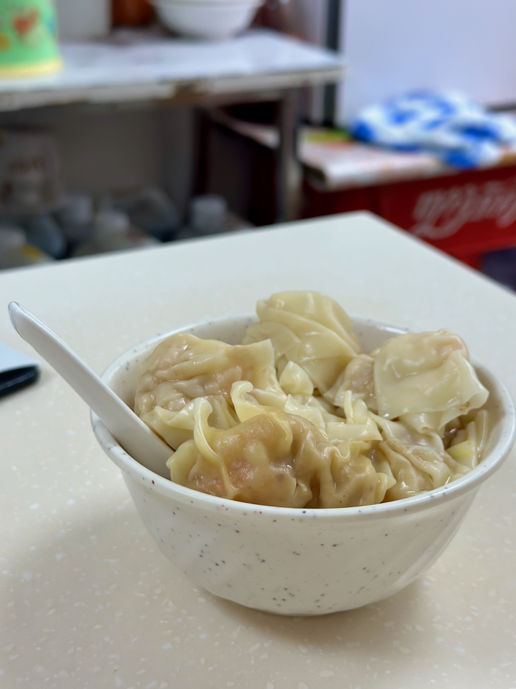

## ลาก่อนเกาลูน

วันที่สี่ในฮ่องกงเป็นวันสุดท้ายที่อยู่ที่โรงแรม The Cityview ข้าวเช้าของวันคือโจ๊กร้าน Hing Kee ส่วนตัวรู้สึกว่าเฉย ๆ ไม่ได้ว้าวอะไร มีสั่งของทานเล่นมาเป็นแป้งนึ่งคล้าย ๆ ก๋วยเตี๋ยวลุยสวน แต่ไม่มีไส้ (มันน่าจะมีแบบมีไส้ด้วย เพราะโต๊ะข้าง ๆ สั่ง แต่เราสั่งไม่เป็น 555) แล้วก็มีสั่งปาท่องโก๋มากินกับโจ๊ก ปาท่องโก๋ที่นี่ใหญ่มาก ปาหัวหมาได้เลย รสชาติก็อร่อยดี กินกับโจ๊กอร่อย

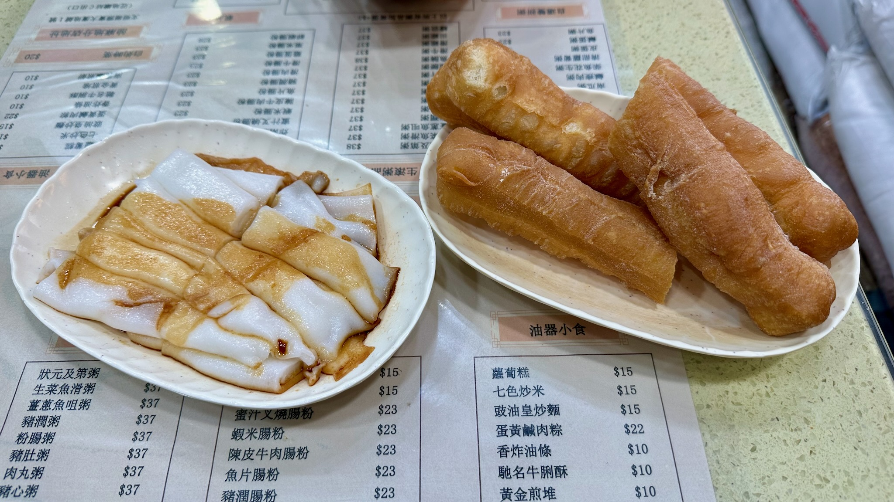

กินข้าวเสร็จก็เดินไปซื้อของแล้วก็หาของกินต่อ ระหว่างเดินก็เลือกเดินทะลุสวนเกาลูน ร่มรื่นแล้วก็สวยดี ในสวนมีสระว่ายน้ำ ศูนย์สันทนาการต่าง ๆ มากมาย แล้วสวนมีขนาดค่อนข้างใหญ่ เดินเข้าออกได้หลายทาง เดินออกจากสวนเสร็จก็เจอย่านคล้าย ๆ สำเพ็งก็เลยเลือกเดินเส้นนั้นแทนเดินถนนใหญ่เผื่อจะได้เจออะไรใหม่ ๆ บ้าง และโชคชะตาก็เข้าข้างพวกเรา!

สิ่งที่เราเจอก็คือ… **แมวส้ม!**

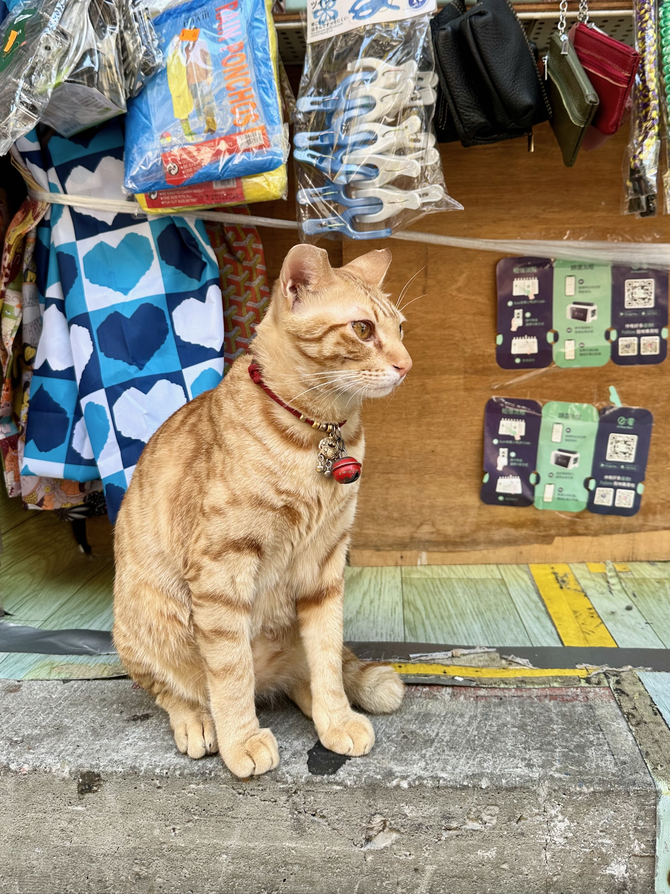

น้องหล่อมาก นั่งรอลูกค้ามาซื้อของอยู่ ทำตัวเป็นเจ้าของร้านที่ดี

หลังจากลาแมวเราก็บังเอิญไปเจอร้าน Hashtag B ร้านนี้ของเด็ดอยู่ที่ Napolean Tart วันก่อนหน้ามีเดินผ่านแล้วทาร์ตเค้าหมด เค้าบอกว่าของลงทุก 10 โมง วันนี้โชคดีของยังไม่หมด เลยจัดมาคนละชิ้น แล้วก็ Yuzu Tart อีก 1 ชิ้น ถือว่าแมวส้มให้โชค ให้ได้กินของโทนส้ม

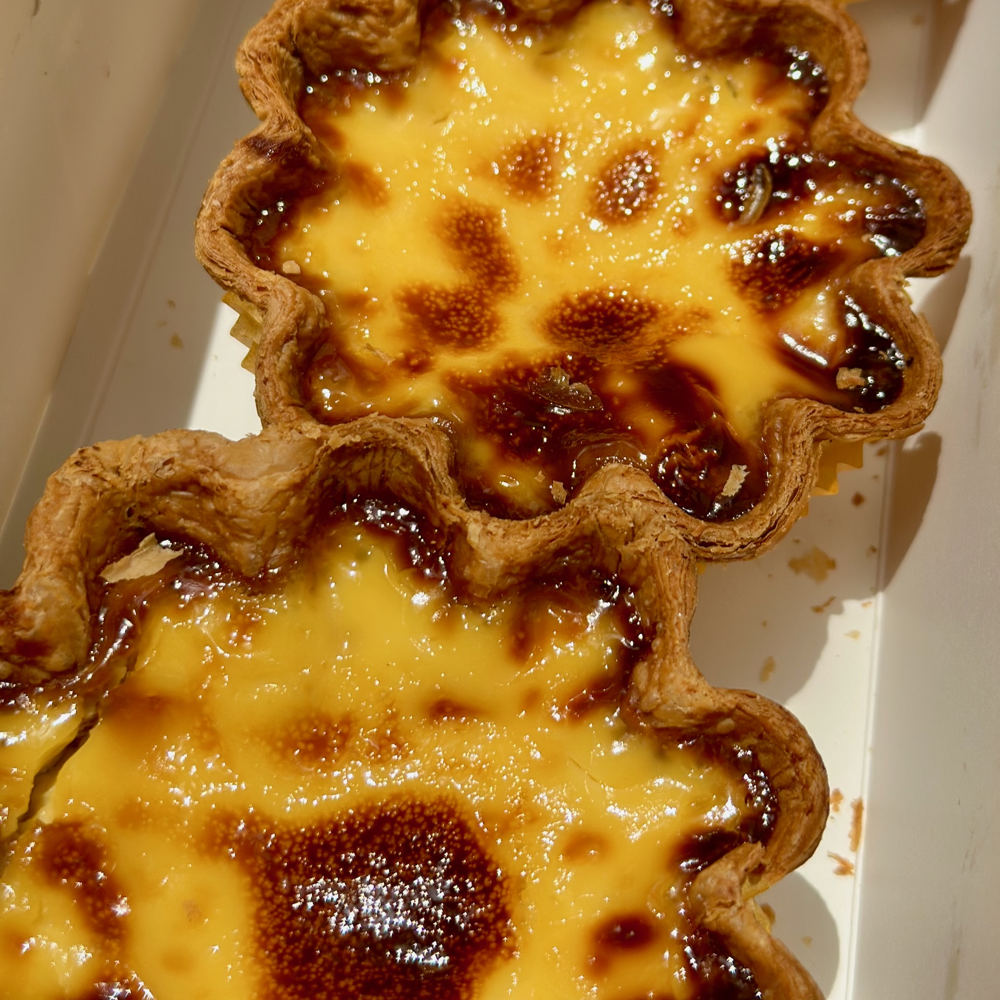

หลังจากซื้อทาร์ตเสร็จก็เดินมากินซาลาเปาทอด อารมณ์คล้าย ๆ เสี่ยวหลงเปาที่ร้าน Cheung Hing Kee ตัวซาลาเปาจะมีน้ำซุปด้านใน แต่แป้งจะเป็นการทอดแทนการนึ่ง ตอนเดินไปที่ร้านก็ยืนดูเมนูหน้าเคาน์เตอร์ พอจะสั่ง อาเจ๊ที่คิดเงินก็ไม่สน ยุ่งอยู่ ทำงานของแกไป ปล่อยให้นี่ยืนรอกับคนข้างหลัง 2–3 คนประมาณเกือบ 5 นาทีได้ สักพักอาเจ๊ก็กลับมารับออเดอร์ เจ๊ถามด้วยน้ำเสียงเซ็ง ๆ ประมาณว่า “เอารัย” นี่ก็ชี้ ๆ อาเจ๊ก็กด ๆ คิดเงิน เรียกคิวถัดไป

ตัวร้านไม่มีที่นั่ง แต่หน้าร้านที่แผ่นไม้ติดกับร้านยื่นออกมา อารมณ์ประมาณโต๊ะลม ยืนกินตรงนั้นได้ ก็เลยยืนกิน เมนูที่สั่งเป็นไส้ต้นตำรับแต่ผสมทรัฟเฟิลลงไป ตอนที่กัดกินคือร้อนมาก แต่หอม อร่อยมาก ใครมีโอกาสขอให้ลอง

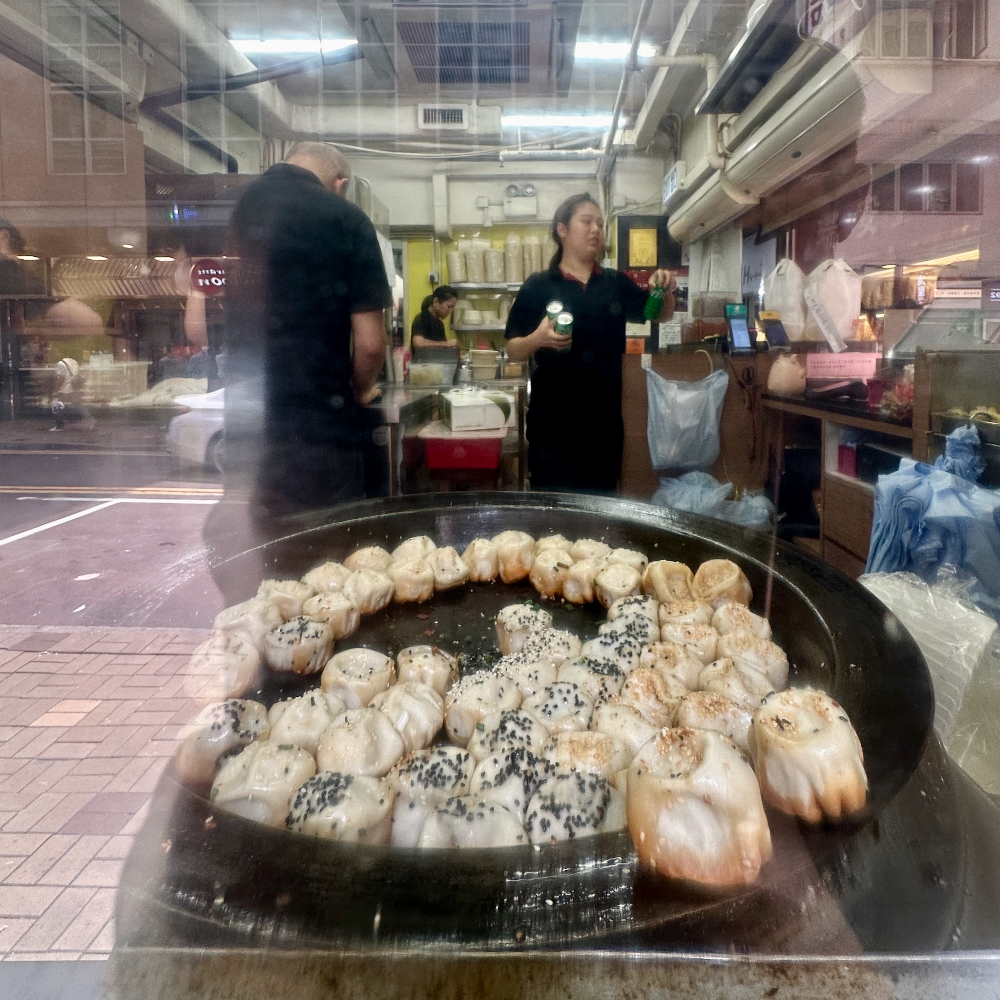

หลังจากซื้อของกินเสร็จก็มาเก็บเอาของเพื่อข้ามน้ำข้ามทะเลไปฮ่องกง ที่เป็นฮ่องกงจริง ๆ

## ฮ่องกงที่เป็นฮ่องกง

ฮ่องกงแบ่งเป็น 2 ฝั่ง ฝั่งที่ติดจีนแผ่นดินใหญ่คือฝั่งเกาลูน ที่เที่ยวส่วนใหญ่อย่างหม่องก็อก จิมซาจุ่ยจะอยู่ฝั่งนี้ กับฝั่งเกาะฮ่องกงที่เคยเป็นของอังกฤษ พูดถึงในมุมประวัติศาสตร์นิดนึงว่าตัวฮ่องกงเองนี่เป็นของอังกฤษอยู่แล้ว (อังกฤษยึดจากสงครามฝิ่น) ส่วนตัวที่อังกฤษเช่า 99 ปีคือฝั่งเกาลูนขึ้นไปทางเหนือจนถึงเสิ่นเจิ้น ส่วนตอนคืนอังกฤษคืนไปทั้งฝั่งเกาลูนและฮ่องกง

ตัวเกาะฮ่องกงนี่มีไวบ์เป็นอังกฤษมาก ๆ บางจุดที่เดินผ่านนี่มีกลิ่นที่คุ้นเคยจากอังกฤษโชยมาปะจมูกด้วย ใครงบไม่พอจะไปอังกฤษก็พอไปเกาะฮ่องกงแทนได้อยู่มั้ง 555

ปัญหานึงที่เจอเวลาเดินทางคือ ฮ่องกงยังไม่เป็นมิตรกับนักท่องเที่ยวมากนัก หลายสถานีมากไม่มีลิฟต์หรือบันไดเลื่อน ใครมีกระเป๋าใหญ่ก็ต้องหิ้วตุเลง ๆ ลงบันไดไป ถ้าเจอชั่วโมงเร่งด่วนก็จะกดดันหน่อย แล้วบางสถานีลิฟต์ไปอยู่ซะสุดสถานี สมมติขึ้นหัวขบวนก็ต้องเดินไปตลอดสถานีจนถึงท้ายสถานีถึงจะเจอลิฟต์ แล้วเจอลิฟต์ขึ้นไปชั้นจำหน่ายตั๋วได้ก็จริง แต่ไม่มีลิฟต์ขึ้นไปขั้นถนน ก็ต้องทุลักทุเลขึ้นไป ดีที่ไม่ลึกมาก

พอข้ามมาฝั่งฮ่องกงแล้วก็เข้าโรงแรม Harbour Grand Hong Kong โรงแรมนี้จองมาราคาแพงกว่า The Cityview เท่าตัวเพราะอยากให้คืนสุดท้ายเป็นที่จดจำหน่อย (ตอนแรกคิดไว้ว่า The Cityview จะแคบ) ปรากฏว่าช่วงที่มามีกฎหมายใหม่บังคับใช้ โรงแรมจะไม่แจกของใช้ในห้องน้ำที่ใช้ครั้งเดียวทิ้ง (เช่น แปรงสีฟัน ยาสีฟัน) และไม่มีน้ำดื่มที่เป็นขวดพลาสติกอีกแล้ว ถ้าอยากได้ต้องซื้อ ในมุมด้านสิ่งแวดล้อมก็เป็นเรื่องที่ดี เพราะขยะจากของใช้แล้วทิ้งเป็นปัญหาจริง แล้วเป็นปัญหาใหญ่ แต่ปัญหาของเราคือ จ่ายมาแพงอยู่ ก่อนกฎหมายนี้จะประกาศใช้ แล้วโรงแรมนี้ไม่ค่อยแก้ปัญหาเท่าไหร่ แทนที่จะมีจุดกรอกน้ำแบบโรงแรมแรก ก็ไม่มี แทนที่จะให้น้ำขวดแก้วแทนขวดพลาสติก ก็ไม่มี (หรือฮ่องกงไม่มีขวดแก้วไม่รู้) อันนี้รู้สึกไม่ค่อยโอเคกับโรงแรมราคานี้ที่วางตัวเป็น luxury

เอาของเข้าที่พักเสร็จก็ออกมารอรถเมล์ไป Repulse Bay รถเมล์ที่ฮ่องกงมีหลายแบบตามแต่ผู้บริการ บางเจ้าเป็นรถชั้นเดียวเหมือนของไทย บางเจ้าเป็นรถสองชั้นเหมือนอังกฤษ​ บางเจ้าเป็นรถมินิบัส สายที่จะนั่งไป Repulse Bay เป็นสายที่เอารถสองชั้นมาวิ่ง นี่ก็นั่งชั้นบนด้านหน้าเพราะเป็นจุดที่ดูวิวดีที่สุด รถก็วิ่งจาก Fortress Hill ไปเรื่อย ๆ เข้าตัวเมืองนิดนึง ช่วงนั้นเป็นช่วงบ่ายแล้วรถก็ติดบ้าง แต่ไม่ติดเท่ากรุงเทพฯ ต่อให้ไฟแดงที่นั่นจะเยอะ สักพักรถก็พ้นจากตัวเมืองเริ่มขึ้นเขา แล้วถนนแถวนั้นค่อนข้างแคบ แต่คนขับขับด้วยความชำนาญก็เลยขับค่อนข้างเร็ว ส่วนคนนั่งก็เสียวไปตาม ๆ กันเพราะมันวิ่งชิดขอบทางมาก ป้ายจราจรบางป้ายมีรอยบิ่นที่ขอบเป็นหลักฐานว่าการเฉี่ยวไม่ใช่เรื่องแปลก

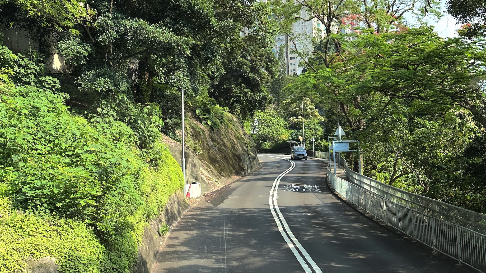

หลังจากนั่งลุ้นชะตาชีวิตไปหลายสิบนาที เราก็มาถึงป้าย Repulse Bay ก็ลงแล้วก็เดินริมชายหาดไป บรรยากาศดีมาก รู้สึกว่าฮ่องกงเป็นเมืองที่มีครบทั้งเมือง ป่า เขา และชายหาด เดินไปเรื่อย ๆ ก็ถึงวัด Tin Hau จะเรียกวัดก็ไม่ถูก ฟีลลิ่งดูเป็นเหมือนศาลเจ้ามากกว่า ปกติคนจะมาไหว้เจ้าแม่กวนอิมกัน แต่ช่วงนั้นเจ้าแม่กวนอิมปิดซ่อม เลยต้องไหว้ขอพรผ่านนั่งร้านแทน

ตรงทางเข้าก็มีพระสังกัจจายน์กับเทพเจ้าโชคลาภอยู่ คนที่เดินเข้ามาก็จะเอาธนบัตรมาลูบจากบนลงล่างแล้วเก็บเข้ากระเป๋า ไม่รู้ว่าถ้าคนที่ไม่ใช้เงินสดอยากทำบ้าง จะเอามือถือเปิดแอปธนาคารแล้วลูบพอแทนกันได้มั้ย

เสร็จแล้วก็เดินดูแถวนั้น มีเทพเจ้าค่อนข้างครบคล้ายไทย เพราะมีพระพุทธ มีพระพรหม และมีเทวดาฟ้าดินอื่น ๆ ด้วย ตรงหน้าจุดไหว้ก็มีป้ายไหว้ภาษาไทยเหมือนกัน มีเยอะกว่าภาษาจีนอีก

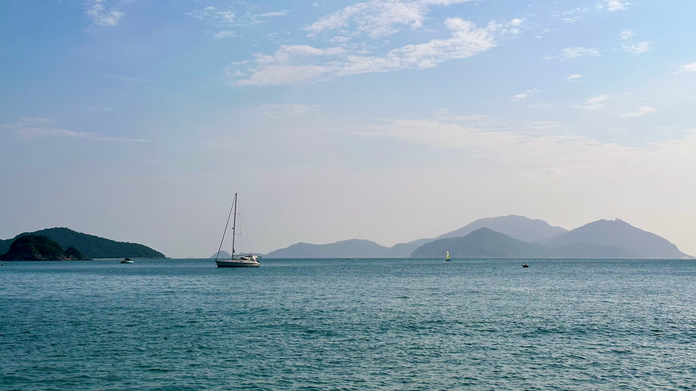

ไหว้เสร็จก็เดินกลับไปรอรถเมล์ รอบนี้จะเข้าเมืองไปขึ้น Victoria Peak ก็เลยรอรถเมล์สาย 40, 40x ซึ่งเดินรถโดย GMB สายนี้เป็นรถมินิบัส แล้วที่นี่ถ้าเต็มก็คือเต็ม ไม่รับเพิ่มเหมือนไทย แล้วถนนเส้นนี้ดูแล้วน่าจะเป็นโซนคนรวย รถเมล์ไม่ค่อยเยอะ แล้วแต่ละทีก็เต็มตลอด รถเมล์สองชั้นยังพอขึ้นได้ แต่สาย 40 ที่รักของเราเต็มทุกรอบ รอไป 4 คันเต็มทุกคัน จนเข้าใจว่า GMB นี่น่าจะย่อมาจาก *Great Misery Bus*

พอเห็นท่าไม่ดีก็เลยตัดสินใจเรียกแท็กซี่แทน แต่ด้วยความไม่รู้เรทราคาและเงินสดเหลือน้อยเลยเลือกที่จะเรียกผ่าน Uber แทน ตอนที่รถมาถึง รถไปจอดฝั่งตรงข้าม ต้องใช้ภาษามือสื่อสารกับคนขับว่าวนมาที 555 แกก็ไปวนมา ระหว่างรอแกวน สาย 40 ก็มาอีกคันมาจอดที่ป้ายเพราะมีคนลง 1 คน ซึ่งเราไปกับแฟนก็ขึ้นไม่ได้แน่ ๆ แล้วออกจากแถวมาแล้ว คนข้างหลังแต้มบุญดีมาก ได้ขึ้นไป 1 คนถ้วน พอคนนั้นขึ้น Uber ก็วนมาถึงพอดี

นั่ง Uber มาลงที่สถานี Ocean Park เพื่อต่อรถไฟฟ้า สายนั้นเป็นสายสั้น ๆ แล้วเป็นช่วงเลิกงานพอดี คนรอเต็มชั้นชานชาลา แล้วคนฮ่องกงนี่ก็พอ ๆ กับคนไทย ขึ้นได้เสร็จก็เกาะเสาตรงกลาง ไม่ยอมเดินเข้าใน ถ้าเป็นเมืองไทยก็จะบอกให้ขยับ แต่พอไปอยู่ต่างถิ่นพูดภาษาเค้าไม่ได้ ก็ใช้สกิลคนกรุงเทพฯ ดัน ๆ เข้าไปได้พอดี รถไฟช่วงนั้นค่อนข้างแน่น แต่เพราะใช้บริการ MRT สายสีน้ำเงิน ที่มีแค่ 3 ตู้ ช่วงที่มาทุก 5–6 นาทีเป็นประจำ เรื่องแค่นี้สบาย ๆ เราเทรนด์มาพร้อม รถไฟสายนี้ก็มี 3 ตู้ ต่างจากสายอื่นที่มี 8 ตู้ รถไฟที่นี่ทุกตู้มี 5 ประตู ทำให้ที่นั่งน้อยลง แต่คนเข้า–ออกได้เร็วขึ้น ซึ่งก็เหมาะกับรถไฟในเมืองแบบนี้

สถานี Ocean Park เป็นสถานีรองสุดท้าย พอรถออกก็วิ่งเข้าอุโมงค์ทะลุเขายาวประมาณ 3 กิโลแล้วมาจอดที่สถานี Admiralty ซึ่งเป็นสถานีปลายทาง ขอบคุณที่ใช้บริการรถไฟฟ้า MTR

สถานี Admiralty นี่ขอยกให้เป็นสุดยอดงานวิศวกรรมและสวรรค์ของคนเล่น Cities: Skylines เลย เพราะเชื่อมต่อหลายสาย มีบันไดเลื่อนที่ยาวและอลังการมาก สามารถยืนดูคนเดินไปเดินมาเหมือนดู sim ในเกมได้ไม่เบื่อเลย บางทีก็รู้สึกว่าตัวเองกำลังรับบทเป็นตัว sim ให้พระเจ้าที่กำลังเล่นเกมอยู่ ขอบคุณพระเจ้าที่สร้างสถานีเชื่อมต่ออลังแบบนี้

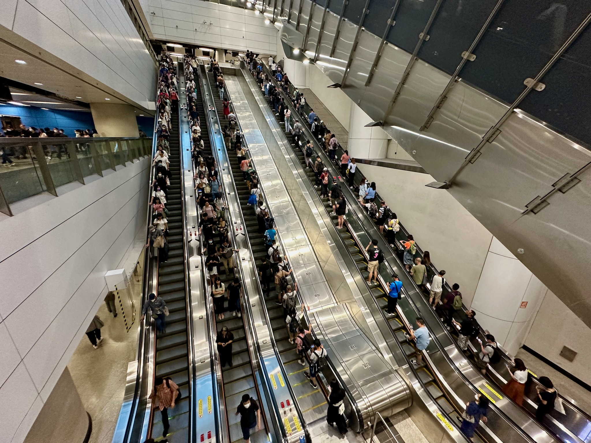

จากสถานี Admiralty เราก็เดินออกมาเรื่อย ๆ จนกระทั่งมาเจอทางขึ้น Peak Tram สถานีคนค่อนข้างเยอะ แต่โชคดีที่มีบัตรปลาหมึกเลยสามารถเข้าได้เลย ไม่ต้องรอซื้อตั๋ว แต่ก็ต้องรอรถอยู่ดี ทั้งระบบมีรถอยู่สองคัน วิ่งสวนกันตรงกลาง ทางขึ้นชันมากเวลามองไปข้าง ๆ ก็รู้สึกหวิว ๆ ได้เลย เพราะมองไปก็คือเหวและยอดตึก บางจังหวะก็คิดในใจว่า ที่นี่ดิสนีย์แลนด์ปะนะ เผื่อเค้าจะปล่อยไหลลงไป 555

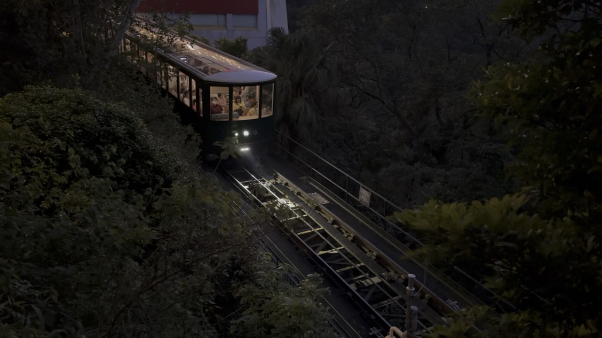

ด้านบนอากาศดีมาก เย็นสบาย เสียดายมาเย็นไปหน่อยเลยไม่ได้ขึ้นไปยอดบนสุด แต่ก็เดินเล่นรอบ ๆ มีเดินลงไปป้ายหยุดรถ Barker Road นิดหน่อย ถ้ามาเร็วกว่านี้ก็คงได้เดินเล่นขึ้นไปแล้วก็เดินลง 555 เพราะราคาค่ารถค่อนข้างแพงตั้ง HK$62 (~300 บาท) ต่อขา ถ้าลงด้วยก็จะลดราคาขาลงเหลือประมาณ HK$26 มั้ง แต่พอจะเดินไปก็คือคิวยาวปานประหนึ่งอยู่ดิสนีย์แลนด์เลยเดินไปขึ้นรถเมล์แทน ที่นั่นมีรถเมล์ 2 สายให้เลือกคันนึงเป็นมินิบัส อีกคันเป็นรถสองชั้น หลังจากเจ็บกับมินิบัสตอนบ่ายมาแล้วก็ตัดสินใจไม่ยากที่จะขึ้นรถสองชั้น คันนึงจุได้ประมาณ 40–50 คน เต็มก็รอคันต่อไป รถออกประมาณทุก ๆ 10 นาที รอไป 2 คันได้ขึ้นคันที่ 3 พอดี ตอนขาลงรถก็ขับไม่เร็วมาก ประมาณ 30–40 กม./ชม. แต่ด้วยความที่มันมืด แล้วก็มองไปด้านข้างก็เป็นเหว มันก็ดูเร็วและหวาดเสียวอยู่ ระหว่างทางเห็นคนโบกรถด้วยแต่รถเต็มก็ไม่ได้ขึ้น หลังจากนั่งไปสักพักก็ลงมาถึง Pedder Street พร้อมความหิวโหย

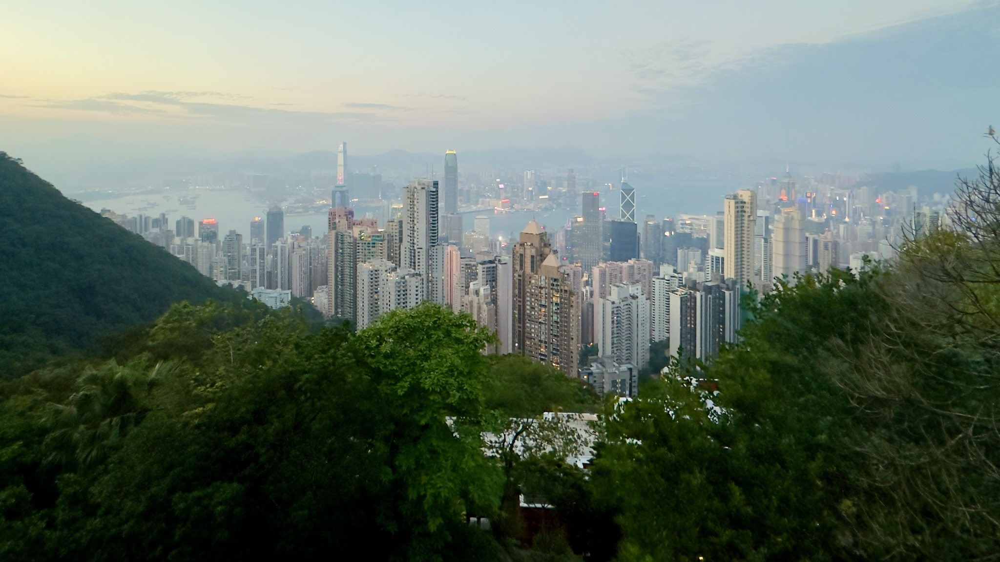

ความพีควันนั้นคือแบตมือถือจะหมดอย่างเดียวไม่พอ เงินสดก็จะหมดด้วย ช่วงนั้นดึกมากแล้ว ร้านที่รับบัตรเครดิตก็หายาก แล้วแถวนั้นมีร้านข้าวร้านนึงดูน่ากินชื่อ Sing Kee เลยลองไปดูราคา คำนวณออกมาแล้วเงินสดไม่น่าพอ ไม่อยากต้องอยู่ล้างจาน เลยไปหาที่กดเงิน ตอนแรกกดด้วยบัตร CIMB ChillD ก็ไม่ได้ บัตรเดบิตแบงค์กรุงเทพฯ ก็ไม่ได้ เลยมาจบที่บัตร SCB Planet แล้วเสียค่ากดต่างประเทศไป HK$21.49 (~230 บาท) พลาดมากที่ไม่มีบัตร YouTrip ของกสิกร เพราะบัตรนั้นกดเงินที่ฮ่องกงฟรี (แต่ต้องหาตู้)

พอกดเงินได้ก็ไปกินข้าว ร้าน Sing Kee ออกแนวร้านรถเข็นตามเยาวราช รสชาติถูกปาก ความสะอาดถูกลืม (ตอนมาหาว่ามันคือร้านอะไรใน Google Maps มีคนลงภาพหนูด้วย lol) ของเด็ดร้านนี้เหมือนจะเป็นผัดหอยลายเพราะทุกโต๊ะสั่งจานนี้เหมือนกันหมด อาหารค่อนข้างอร่อยเลยทีเดียว ผัดผักก็อร่อย ราคาจบออกมาค่อนข้างแพง เพราะร้านมีขั้นต่ำ HK$100 ต่อคน

กินเสร็จก็ไปหาที่เดินย่อย เดินไปริมน้ำแถวท่าเรือ Star Ferry ดูวิวรับลม อากาศดีมาก ๆ แต่วิวจากฝั่งฮ่องกงมองไปฝั่งเกาลูนไม่ค่อยสวยเท่าไหร่ จากฝั่งเกาลูนมองมาสวยกว่า

ริมน้ำแถวนั้นก็มีสวนสาธารณะด้วย ตอนเดิน ๆ อยู่ก็รู้สึกว่าสิ่งนึงที่กรุงเทพฯ ขาดไปอย่างมากคือ [third place](https://www.youtube.com/watch?v=VvdQ381K5xg) ซึ่งมันคือสถานที่ที่ไม่ใช่บ้าน และไม่ใช่ที่ทำงาน เป็นสถานที่ที่ไว้พบปะเพื่อนฝูง ออกเดท หรือเติมเต็มช่องว่างระหว่างวัน ร้านอาหาร ร้านกาแฟ หรือสวนสาธารณะที่เปิดดึกหน่อยให้คนมีเวลาได้มาใช้ชีวิตกันหลังจากทำงานเสร็จ third place ทำให้คนได้พบปะกันและไม่เหงา เราเคยนั่งคุยกับเพื่อนในร้านกาแฟตอนค่ำ ๆ แล้วรู้สึกว่านี่คือสิ่งที่ใช่มาก บรรยากาศสงบ ๆ แต่ก็ไม่วังเวงมันทำให้บทสนทนาลื่นไหล และน่าสนใจ รู้สึกว่าบทสนทนานั้นเป็นบทสนทนาที่มีคุณภาพมาก

บ่นเรื่องนี้พอละ 555 กลับมาที่สวนริมน้ำกันต่อ หลังจากที่เดินไปเรื่อย ๆ ก็มาถึงแถวศาล แล้วก็เจอสถานี Admiralty ก็เลยนั่งรถไฟฟ้ากลับแล้วมือถือแบตหมดพอดี! แล้วเราก็ผูกบัตรปลาหมึกไว้กับ Apple Wallet เพราะอยากเป็นประชากรโลกที่ 1 กับเขาด้วยไง ว้าวุ่นเลยทีนี้

ปรากฏว่า Apple Wallet สามารถใช้ตอน iPhone แบตหมดได้! เคยรู้มาสักพักตอนหาอ่านเกี่ยวกับ Apple Wallet แต่ไม่คิดว่าจะต้องมาใช้จริง 555 ก็เลยลองแตะดู *ปี๊บ!* ประตูเปิดให้เข้าไปได้ตามปกติ และขาออกก็ออกได้อย่างไม่มีปัญหา รอดไปอีกวัน

วันนั้นเดินไปเกือบ 17 กิโล

## วันสุดท้าย

วันสุดท้ายในฮ่องกงเริ่มต้นเก็บของตอนเช้าแล้วก็เอากระเป๋าไปหย่อนไว้ที่สถานีรถไฟ Cathay Pacific มีบริการเช็คอินในเมือง (in-town check in & bag drop) แล้วก็สามารถทิ้งกระเป๋าไว้ได้เลยเหมือนที่ไทยพยายามจะทำที่มักกะสัน เงื่อนไขก็คือ ต้องบิน Cathay Pacific และต้องนั่ง Airport Express ไปสนามบินเท่านั้น (เพราะต้องเข้าผ่านประตูเก็บค่าโดยสาร) ใครไปคนเดียวก็แตะบัตรปลาหมึกเข้าไปได้เลย [ถ้าไปเป็นคู่ให้ซื้อตั๋วคู่จะถูกกว่า](https://www.mtr.com.hk/en/customer/tickets/promotions_4persons.html) จาก HK$100/คน จะเหลือ HK$85/คน (HK$170/คู่)

สถานีที่หย่อนกระเป๋าได้มีแค่ที่สถานีฮ่องกงเท่านั้น ส่วนสถานีอื่นสามารถเช็คอินออน์ไลน์ได้อย่างเดียว

หลังจากซื้อตั๋วแตะเข้าไปในสถานีเพื่อส่งกระเป๋า + เช็คอินแล้ว ก็สามารถแตะบัตรออกมาเที่ยวต่อได้ สะดวกมาก ๆ นอกจากนี้ใครใช้ Airport Express ก็จะสามารถ[ใช้รถไฟฟ้าของ MTR ได้ฟรีด้วย](https://www.mtr.com.hk/en/customer/services/complom_connections.html) (ภายใน 1 ชม. หลังจากใช้ Airport Express จากสนามบิน) ส่วนขาไปสนามบิน ถ้านั่งรถไฟฟ้า MTR มาขึ้น Airport Express ก็จะนั่งรถไฟฟ้าฟรี คิดแค่ค่า Airport Express ถือว่าเป็นนโยบายที่ดีมาก ๆ ให้คนมาใช้ระบบขนส่งมวลชน

พวกเราก็ออกมาเที่ยวกันต่อ วันนั้นเน้นซื้อของฝาก แน่นอนว่า POP MART ก็เป็น 1 ในร้านที่ไป แล้วทุกร้านที่ไปมีแต่คนไทย แล้วของยอดฮิตแบบลาบูบู้ก็ขายหมดทุกที่ นอกจาก POP MART ก็มีแวะดูร้านอื่น + เที่ยวระหว่างทางอีกนิด ๆ หน่อย ๆ

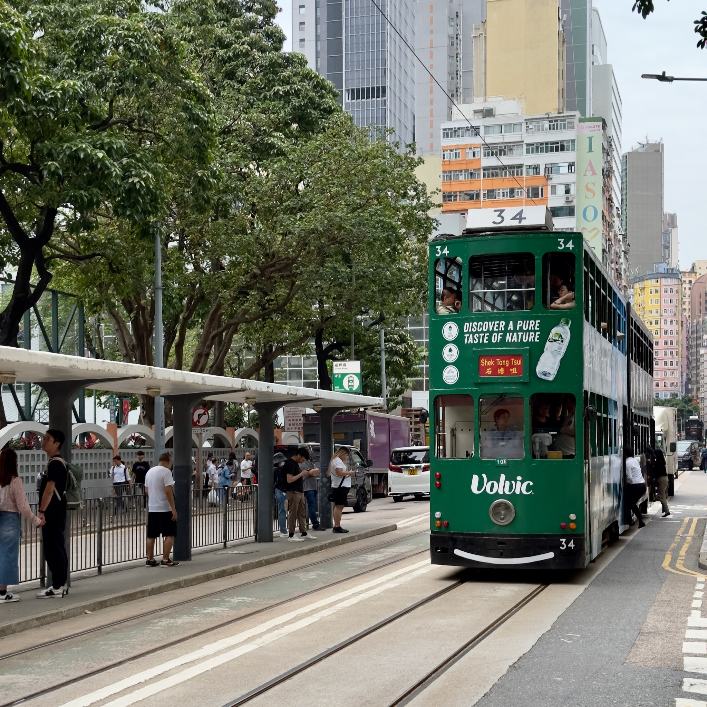

วันนั้นเน้นเดินทางด้วยรถราง ค่าโดยสารถูกมากแค่ HK$3 (~15 บาท) ถ้าจ่ายด้วยบัตรวีซ่าก็เหลือ HK$2 ตัวรถเป็นรถสองชั้น ด้านในค่อนข้างแคบ ฝั่งซ้ายเป็นเก้าอี้หันหน้าไปด้านหน้ารถนั่งได้คนเดียว ฝั่งขวาเป็นแถวยาวหันเข้ารถเหมือน 2 แถว ตอนนั่ง ๆ ไปอยู่แล้วมันไปติดอยู่แยกนึงเพราะรถข้างหน้าติด ๆ ต่อ ๆ กันมาทำให้รถรางที่ต้องเลี้ยวขวาเลี้ยวไม่ได้ ทั้ง ๆ ที่ไปคนละทางกับหางแถวที่รถติดเลย อันนี้ก็เป็นอีกผลนึงว่าทำไมระบบขนส่งควรมีทางแยกเป็นของตัวเอง

ตัวรถรางเหมือนเอารถรางเก่ามาปรับปรุงใหม่เพราะมีพวงมาลัยคนขับแบบเก่าอยู่ด้านหลัง เป็นจุดถ่ายรูป และสร้างแรงบันดาลใจให้เด็ก ๆ ได้ดีเลย

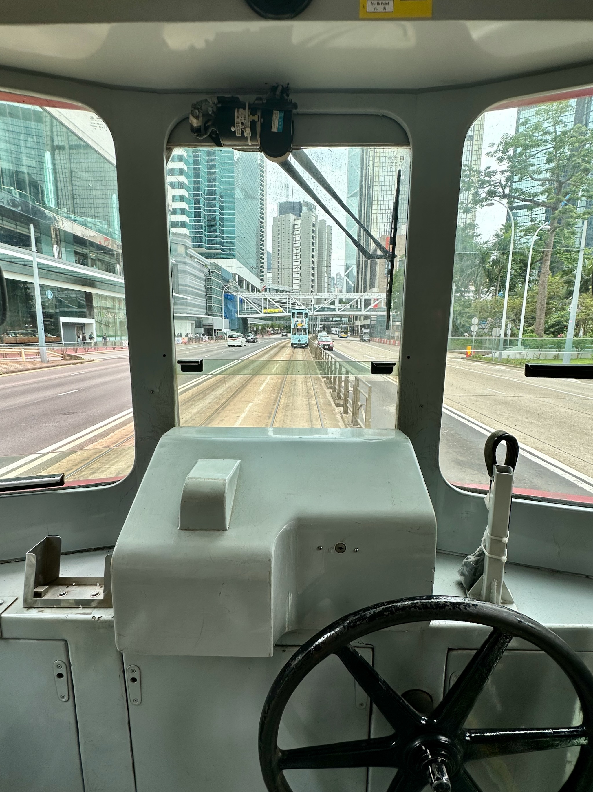

ระหว่างทางมีแวะระบบทางเลื่อนที่ยาวที่สุดในโลก มันเป็นทางเลื่อนเชื่อมระหว่างย่าน Central กับ Mid-Levels ซึ่งเป็นโซนระหว่างยอดวิกตอเรีย (Victoria Peak) กับเมืองด้านล่าง ตัวทางเลื่อนก็ไม่มีอะไรมาก ส่วนใหญ่มีแต่นักท่องเที่ยว 555 ทางเลื่อนมีแค่ฝั่งเดียว ถ้ามันเลื่อนขึ้นอีกฝั่งก็ต้องเดินลง ถ้าเลื่อนลงอีกฝั่งก็ต้องเดินขึ้น ถือว่าได้ออกกำลังกายกัน

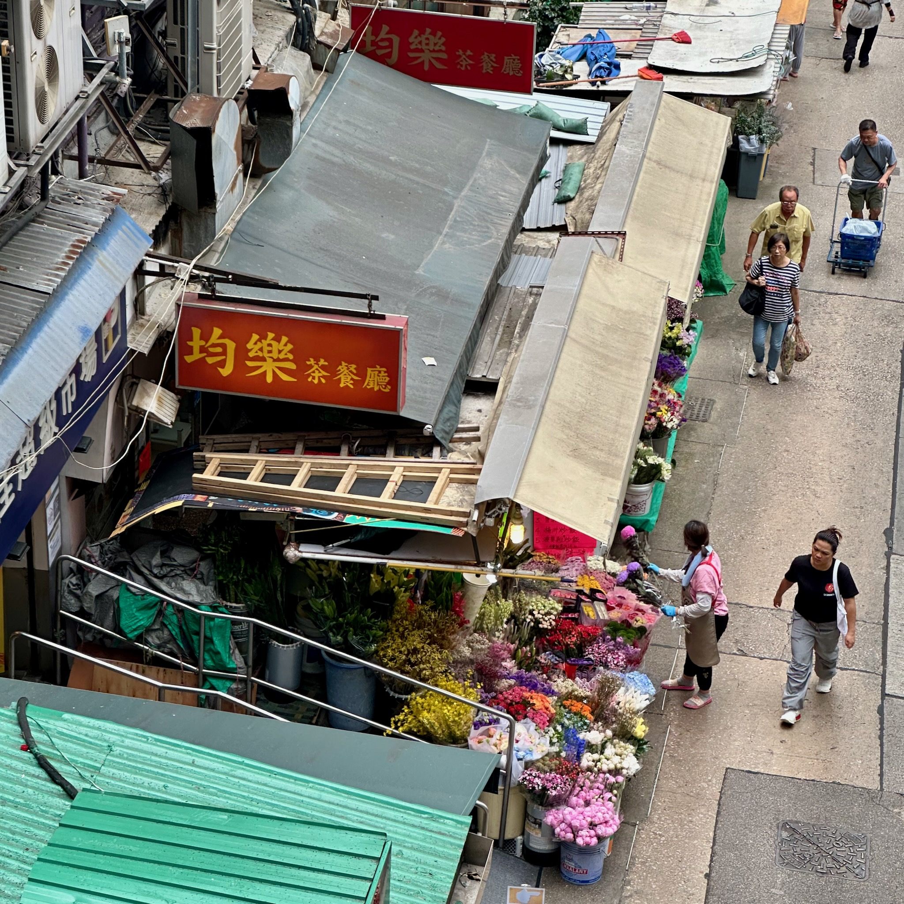

หลังแวะนั่นนี่ ซื้อของซื้ออะไรเสร็จ ใกล้ถึงเวลาบินแล้วแต่ตัวยังอยู่บนเกาะฮ่องกง เพราะยังมีสิ่งนึงที่ยังไม่ได้กิน สิ่งนั้นก็คือ… วาฟเฟิลฮ่องกง (ที่นั่นเรียก Egg puff)

ตอนนั้นรีบเดินหามาก ๆ กดกูเกิลหาร้าน Mammy Pancake ตามที่บล็อคของชินแนะนำก็เจอ[ร้านนึงตรงแถว Haven St](https://maps.app.goo.gl/TAi37fnVMF2bzC4UA) ที่ต้องพูดถึงร้านนี้เพราะว่าคนขายยิ้มแย้มเป็นมิตรน่าประทับใจมาก คนขายเป็นผู้ชายวัยกลางคน หน้าตายิ้มแย้มแจ่มใสตลอดเวลา ตอนที่ถามแล้วก็สั่งออเดอร์ แกยิ้มแย้มตลอด ใบหน้านี่ปนรอยยิ้มตลอดเวลา เห็นแล้วสบายใจมากที่จะซื้อของด้วย รสชาติก็อร่อยเลยทีเดียว (แต่ก็ไม่ต่างกับที่ไทยมาก lol) ร้านนี้มีหลายสาขา ถ้ามีโอกาสไปแถวนั้นก็คงไม่พลาดที่จะอุดหนุนร้านนี้อีก

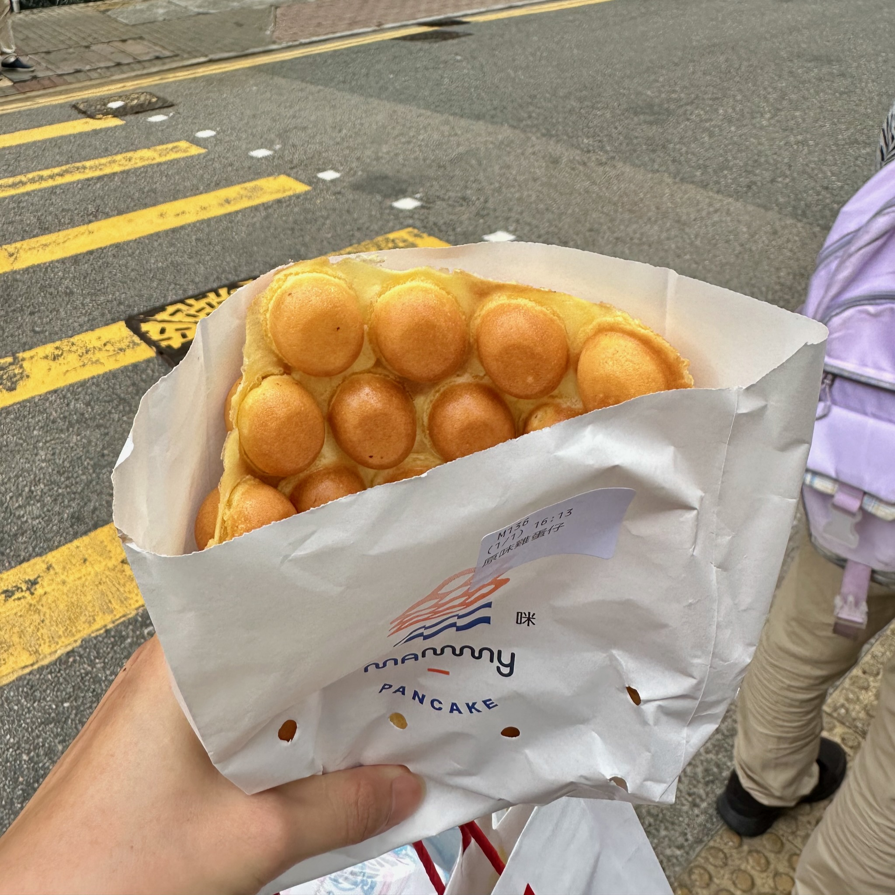

เสร็จสิ้นภารกิจเรียบร้อยก็ใกล้เวลาที่ต้องไปสนามบิน ก็นั่ง Airport Express กลับด้วยตั๋วที่ซื้อไว้ รถไฟที่นั่นค่อนข้างใจดี ประตูปิดไปรอบนึงแล้วมีคนรีบวิ่งมาก็เปิดรับใหม่ ปิด ๆ เปิด ๆ อยู่ 2–3 รอบได้ รถออกทุก ๆ ~10 นาที นั่งไปประมาณ 20 กว่านาทีก็ถึงสนามบิน แน่นอนว่ารถไฟก็จอดชั้นผู้โดยสารขาออกเลย ไม่ต้องเดินหาทาง หลังจากผ่านตม.เรียบร้อยก็เดินตามป้ายเลขเกทไปเรื่อย ๆ ป้ายก็ชี้ให้ลงไปข้างล่าง เดินลงไปเรื่อย ๆ ก็เจอชานชาลา APM ซึ่งงงมาก นึกว่าได้อาคาร satellite แต่ก็ขึ้นไป ตัวรถวิ่งค่อนข้างไว แปบเดียวก็มาถึง พอขึ้นมาข้างบนก็เจอว่ายังอยู่ในอาคารเดิม แค่ขยับมาอยู่ฝั่งปลายตะวันตกของสนามบิน ถ้าจะเดินมาก็เดินมาได้

สนามบินฮ่องกงสะอาด เรียบร้อย หน้าต่างสูงและกว้าง เห็นเครื่องบินหลายลำมาก ๆ ใครชอบดูเครื่องบินก็น่าจะชอบที่นี่

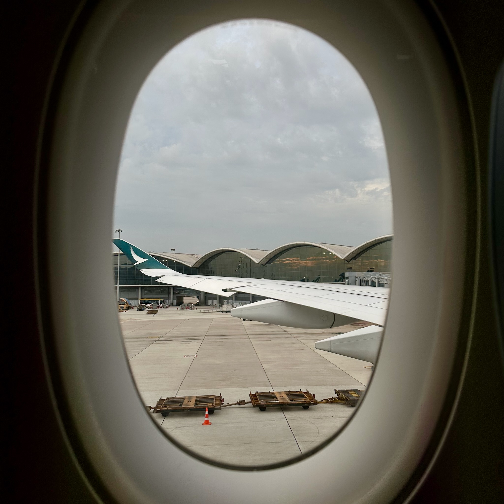

## จิปาถะ

อันนี้ไม่รู้จะไว้ส่วนไหนดี แต่อยากเล่า

### Cross-platform Interchange

รถไฟของฮ่องกงจะมีบางสถานีที่วิ่งขนาดกันไป 2–3 สถานี เค้าก็เลยออกแบบให้สามารถเปลี่ยนข้ามกันได้บนชั้นชานชาลาเลย ไม่ต้องขึ้น–ลงบันไดเลื่อนไปเปลี่ยนที่ชั้นอื่น

ถ้ายกตัวอย่างให้ง่ายที่สุดก็คือนั่งรถสาย Tsuen Wan มาจากสถานี Tsuen Wan ไปยัง Central (วิ่งลงใต้) แล้วต้องการเปลี่ยนไปสาย Kwun Tong ซึ่งตีคู่กันยาว 3 สถานี

1. ถ้าจะเปลี่ยนไปปลายทาง Tiu Keng Leng ให้ลงที่ Prince Edward
2. ถ้าจะเปลี่ยนไปปลายทาง Whampoa ให้ลงที่ Mong Kok
3. ถ้าจะย้อนกลับไป Tsuen Wan (ของสาย Tsuen Wan ที่นั่งอยู่) ให้ลงที่ Yau Ma Tei

แล้วพอลงก็แค่เดินข้ามไปชานชาลาฝั่งตรงข้าม ไม่ต้องเสียเวลาเปลี่ยนชั้น แต่ถ้าอยากจะลงสถานีอื่นก็ได้ แค่ต้องเปลี่ยนชั้นแค่นั้น

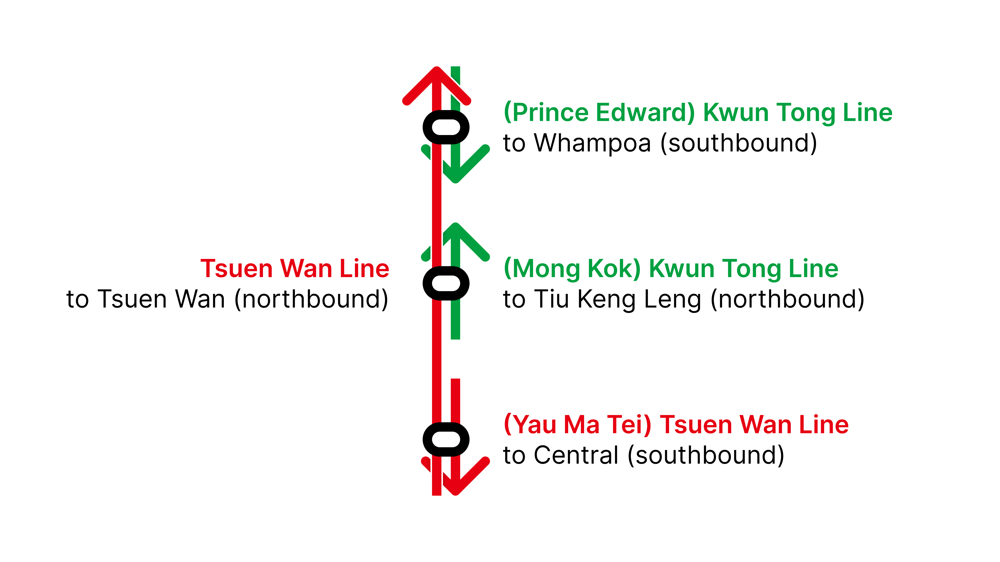

ในกรุงเทพฯ เรามี cross-platform interchange ที่สถานีสยาม สายสุขุมวิทแยกชั้นไปเจอกับสายสีลมที่มุ่งหน้าทิศทางเดียวกัน (ลองนึกภาพว่าไม่เป็นแบบนี้แล้วคนที่มาจากสายสุขุมวิทต้องลงบันไดเลื่อนทุกคน สายสีลมต้องขึ้นมาชั้นบนทุกคน สถานีแตกแน่นอน)

### รถเมล์ vs รถไฟ

สิ่งนึงที่ค่อนข้างประหลาดใจในฮ่องกงคือ รถเมล์แพงกว่ารถไฟฟ้า ยกตัวอย่างเช่นนั่งจากเกาลูนไปโรงแรม The Cityview ถ้าเป็นรถเมล์มีราคา HK$6.40, 7.50 ไปจนถึง 12.10 แต่รถไฟฟ้าราคาแค่ HK$4.80 (ทั้งแบบนั่งตรงและเปลี่ยนสาย) เจอหลายครั้งมากที่เป็นแบบนี้ เท่าที่เข้าใจคือ MTR (คนเดินรถไฟฟ้า) มีสายรถเมล์ในมือไม่กี่เจ้า รถเมล์ส่วนใหญ่เป็นของเอกชนเจ้าอื่น เช่น Citybus, GMB เป็นต้น แล้วตรงนั้นจะตั้งราคายังไงก็ได้ (ภายใต้ข้อกำหนดของรัฐบาล)

### จักรยาน รถยนต์ และที่จอดรถ

อีกความแปลกใจนึงคือคนฮ่องกงไม่ค่อยใช้จักรยานกัน ตัวภูมิประเทศฮ่องกงฝั่งเกาลูนก็ค่อนข้างเรียบ ไม่ชัน สภาพอากาศก็ไม่ร้อนไป ไม่หนาวไป เมืองก็มีความหนาแน่นพอ แต่กลับไม่ค่อยมีคนขี่จักรยาน เท่าที่อ่านผ่าน ๆ ในวิกิพีเดีย เหมือนกับรัฐบาลไม่ได้ส่งเสริมมาก เพิ่งจะอนุญาตให้เอารถจักรยานขึ้นรถไฟฟ้าได้เมื่อไม่นานมานี้เอง แล้วไม่มีเลนจักรยาน หรือโครงสร้างที่จะทำให้คนรู้สึกปลอดภัยในการขี่ อันนี้ก็เป็นตัวอย่างที่ดีว่านโยบายภาครัฐส่งผลต่อการตัดสินใจประชาชนค่อนข้างมาก induced demands สามารถใช้ให้เป็นคุณได้ ถ้าทำขอให้ดีพอ เดี๋ยวคนก็มาใช้เองไม่เกินจริงในหลาย ๆ ครั้ง

รถยนต์ที่นี่ค่อนข้างน้อย บางทีเห็นรถเมล์บนถนนมากกว่ารถยนต์ซะอีก ฮ่องกงคือเมืองที่จัดการดีในแง่ที่ว่า คนในเมืองสามารถใช้ชีวิตได้โดยไม่ต้องมีรถยนต์ เพราะไม่ใช่ทุกคนที่จะขับรถได้ (เด็ก คนพิการ คนแก่ หรือคนที่ไม่อยากขับรถ) เราไม่ควรสร้างเมืองที่บังคับให้ทุกคนต้องขับรถ เพราะสุดท้ายแล้วรถก็จะติด แล้วก็เป็นปัญหาเรื้อรังทำลายทั้งสุขภาพกาย สุขภาพจิต เงินในกระเป๋าของทุกคน ที่จอดรถในฮ่องกงราคาค่อนข้างแพง เท่าที่เห็นคือ HK$15–20+ ต่อชั่วโมงเลยก็มี แล้วที่จอดรถไม่เยอะมาก เป็นการทำให้การนั่งรถสาธารณะสะดวกกว่าขับรถเอง

### แผนที่

มีความรู้สึกว่า GPS ในฮ่องกงจับได้ไม่ค่อยแม่น บางทีข้ามไปอยู่อีกถนนนึง แล้วไม่ได้เป็นแค่เครื่องเรา เครื่องแฟนก็เป็น (iPhone ทั้งคู่) ไม่รู้เหมือนกันว่าเป็นที่อะไร แล้วถ้าจะดูวิธีเดินทาง Google Maps ไม่ค่อยดีเท่าไหร่ บอกเวลารถไม่ค่อยตรง ไม่บอกราคาค่าโดยสาร

ถ้าใครจะไป ขอแนะนำให้ใช้ [Citymapper](https://citymapper.com) ในนั้นบอกเส้นทางได้ดีกว่า บอกเวลารถได้ตรงกว่า หลายสายมีบอกราคาค่าโดยสารด้วย สามารถใช้ Live Activties ใน iPhone เพื่อบอกว่าอีกกี่ป้ายต้องลง สามารถมีเสียงบอกได้ว่าถึงป้ายแล้วด้วย

## สรุป

ฮ่องกงเป็นเมืองที่เที่ยวสนุกดี ราคาโรงแรมไม่ได้แพงขนาดนั้น แต่ราคาอาหารค่อนข้างแพง ถ้าใครชอบเล่นเกมจัดการเมืองอย่าง Sim City หรือ Cities: Skylines ฮ่องกงเป็นเมืองที่ตอบโจทย์มาก ๆ ไปยืนดูเหล่า sim เปลี่ยนขบวนที่สถานี Admiralty ก็เป็นความสุขดี ได้ไอเดียใหม่ ๆ มาสร้างเมืองเพิ่มอีกเยอะเลย

อากาศดี จัดการดี เดินทางดี อาหารอร่อย (แต่แพง) ใครมีโอกาสก็ลองไปดู ส่วนตัวยังอยากกลับไปนั่งรถไฟเล่น แล้วนั่งรถไปถึงจีนด้วย

ไว้พบกันใหม่ในบล็อคหน้าครับ
